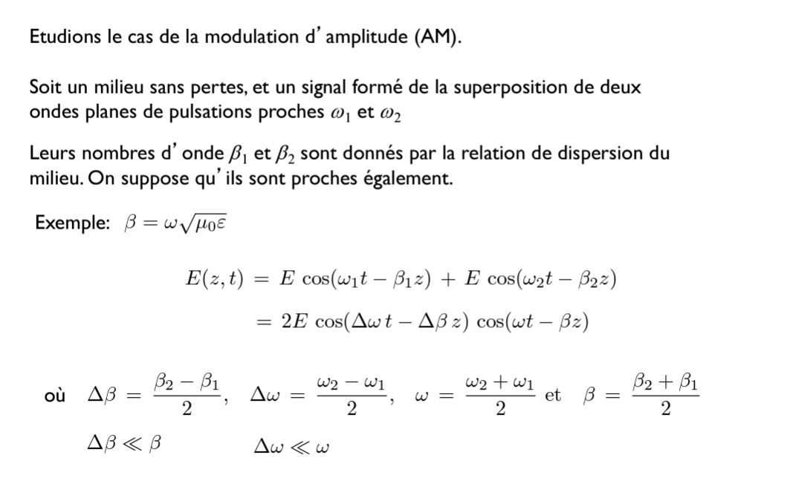
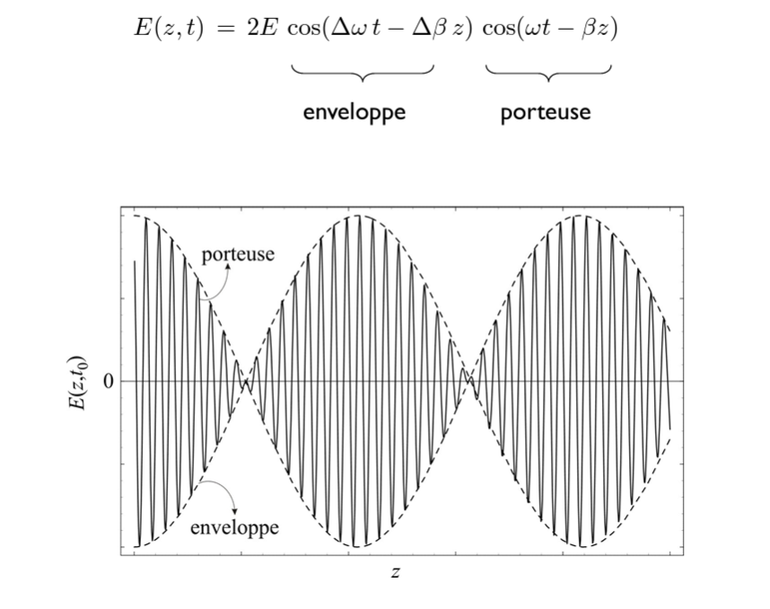

# ELEC-H304 PhysTel - cours 10 - 19/03/2024

## Chap 7 - Milieux diélectriques et conducteurs

### 7.2 Propagation dans les milieux
#### Permittivité équivalente

  

  
Chaque matériau est caractérisé par une conductivité  
Effet de permittivité, effet diélectrique et effet joule  
Ce $\sigma$ représente les dissipations sous forme de chaleur  

  

#### Equations de propagation

  

  
> pour une notation plus compacte.  
> $\gamma$ est bien un nombre compalexe.  

  

  
Cette onde plane ("inhomogène") aura son amplitude qui va décroitre (exponentiellement) avec la distance.  
**Profondeur de peau $\delta$**: distance caractéristique d'atténuation de l'onde.
**"longueur d'onde"**: pas vraiment longueur d'onde car pas périodique, mais on ka définit par exemple comme la distance entre deux maxima d'amplitude.

  

  

  
> bug pdf: $f$ = 900MHz  

#### exemple de modélisation
slides 27-33  

#### Milieux sans pertes

  
> bug pdf: $\sigma$ = 0  

Pourquoi cette vitesse de propagation semble plus lente?:  
L'interférence entre le champ incident et le champ secondaire crée une onde qui semble se propager à une vitese plus lente  

#### Milieux bon conducteurs
  
> cas particulier des conducteurs parfaits: l'onde va être arrêtée net sur un conducteur parfait, elle ne va pas se propager dedans.  

  
> donc les comm dans l'eau de met se fait par onde sonore  

#### Plasmas

  

  

#### Vitesses de phase et de groupe

  
cette vitesse $\ne$ vitesse de la lumière dans le vide $c=\frac{1}{\sqrt{\epsilon_0 \mu_0}}$  

> slide 40 passé ?

  

  

  

  

  
Il y a deux cosinus: un cosinus rapide et un cosinus beaucoup plus lent.  
ça donne:  
  

  
> bug pdf: "...pulsation $\omega$, la vitesse..."  
Vitesse de groupe: de l'enveloppe  
Vitesse de phase: de la porteuse  

Vitesse de groupe dépend de la fréquence, donc si on envoie à plusieurs fréquences, la forme que le récepteur reçoit ne sera pas la même que la forme envoyée. => problème.  

  

##### Synthèse

  

----------------------

## Chap 8 - Réflexion, transmission et diffration

### Rappel
  

#### Les conditions aux interfaces

  
possible discontinuité à l'interface entre deux matériaux  

  

  

#### Les lois de Snell
  

