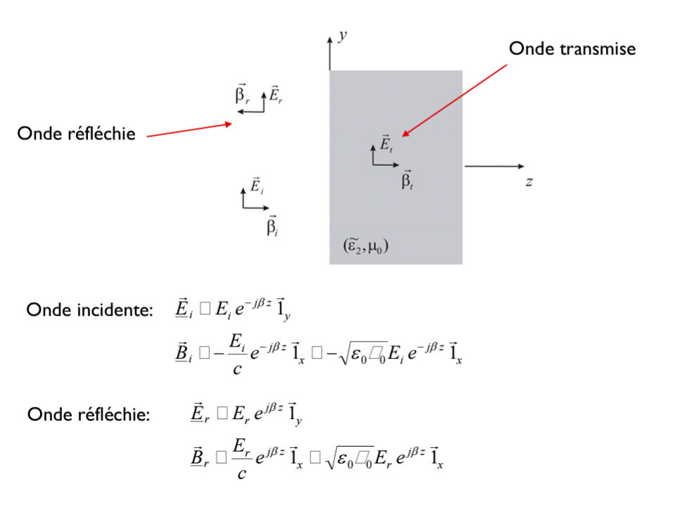
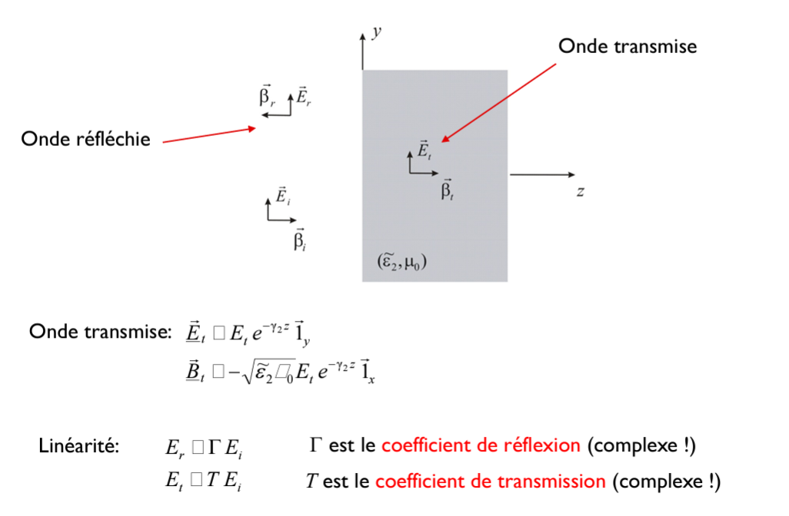
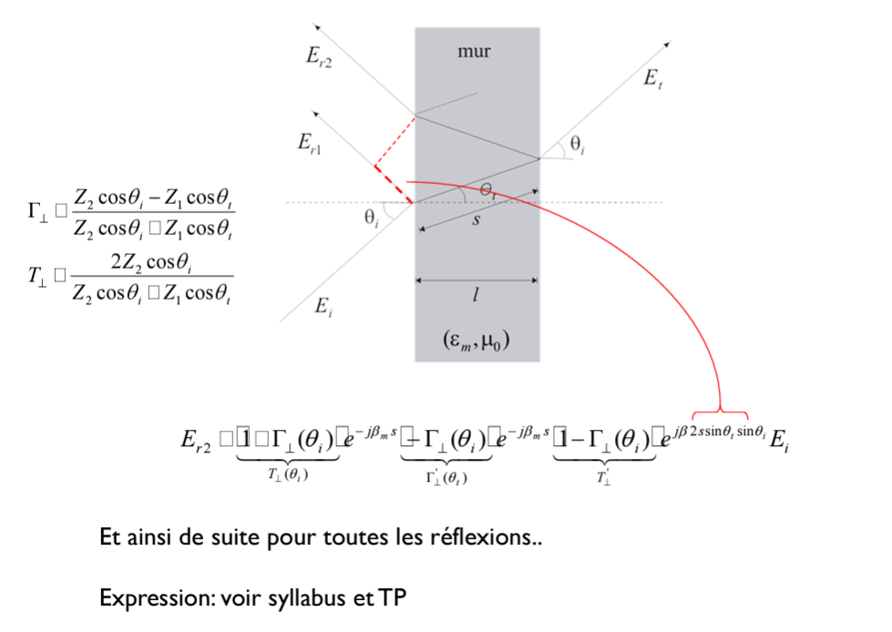

# ELEC-H304 PhysTel - Cours 11 - 20/03/2024

## Chap 8 - Réflexion, Transmission et Diffraction
suite

### Réflexion et transmission
#### Incidence normale sur un conducteur parfait
cas simple:  
  

  
Cette nappe de courant va créer une (vraie) onde plane, qui va se propager en z positif et (dans l'autre sens) en z négatif.  

  
> $Z_0=\sqrt{\frac{\mu_0}{\epsilon_0}}$  
> $c=\frac{1}{\sqrt{\epsilon_0 \mu_0}}$  

$\Rightarrow$ L'onde incidente est totalement réfléchie  

  
$\Rightarrow$ Sur l'interface en z=0, le champ électrique total est nul  

> c'est bien un cas académique mais il permet de facilment trouver car on connait déjà la sotution (le champ dans le conducteur parfait est nul)  

  
> $B_s$ se propage bien vers la gauche et $B_i$ se propage bien vers la droite  

Est-ce qu'il y a moyen de généraliser ceci à un cas quelconque ? :  
  
pas terrible la methode itérative, alors...  

#### Incidence normale sur un milieu dissipatif
  
> bug pdf: ce sont des $=$  

  
> bug pdf: ce sont des $=$  

On a deux inconnues: $E_t$ et $E_r$  
On ne va pas les chercher directment mais on va chercher leur coefficients de proportionalité avec $E_i$: $\Gamma$ et $T$  

  
> bug pdf: ce sont des $( )$, $[ ]$, $=$ et $\mu$  

On utilise les deux relations de continuité.  

  
> bug pdf: meme chose  

  
> bug pdf: ce sont des $=$, $+$ et $\mu$  

$\Gamma$ : même forme que les coeff de relfexion dans lignes de transmission mais pas la même chose, c'est juste une analogie mathématique.  

Il y a bien une atténuation exponentielle de ce champ transmis. Le courant (densité de courant) aussi. C'est bien ce courant qui est responsable de l'onde que l'on appelle l'onde réfléchie.  

On va continuer à généraliser:  
#### Deux diélectriques sans pertes
  
> bug pdf  
> on se limite aux $\varepsilon$ réels (donc pas de pertes), sinon complexité mathématique bcp bcp bcp bcp bcp bcp bcp trop complexe, vraiment trop complexe. C'est une approx utilisée par tout le monde et logiciels.  

Expression mathématique du champ incident, onde plane  

Réfléchis:  
  
> bug pdf  
> on a choisis ici par convention le r vers le haut  

Transmis:  
  
> bug pdf  

> bug pdf  

On a l'expression des champs incidents, réfléchis et transmis.  
Par loi de Snell, $\theta_i=\theta_r$  

  
> bug pdf  

La loi de Snell reste valable.  
> comment calculer le cosinus d'un nombre complexe? on remplace le cos par sa forme exponentielle. Mais bon on va pas faire ça de toute manière.  

  
> bug pdf  

  
> bug pdf  

On résout et on obtient $\Gamma$ et $T$  
**Anlge de Brewster**: angle tel que l'onde réfléchie est nulle:  
On peut avoir aucune onde réfléchie (quand $\Gamma=0$): on explique ça physiquement, les petits dipoles qui bougent, sauf dans leur axe... bref voilà...  

  
Obtenu dans le cas de l'autre polarisation  
> c'est un bon exercice pour se familariser  

#### Transmission et réflexion par un mur - **important pour le projet**
> projet: mur d'épaisseur finie...  
  
> bug pdf: $=$  

$E_{r1}$ est l'onde réfléchie avant même qu'elle sache que le mur n'est pas infini. $E_{r2}$ est l'onde réfléchie après être rentrée dans le mur (où il y a aussi une transmise après le mur).  
Donc ce sera la superposition de ces réflexions  

  

**SLIDES MANQUANTS** : voir photo? ce sera fait au TP, sinon voir syllabus  
> ce sera ces trucs qu'on devra faire dans le projet  
> ce sera fait avec Quentin au TP  

#### Réflexion totale
  
> bug pdf: $\varepsilon_1>\varepsilon_2$  

Rien va être transmis.  
C'est le moyen de fonctionnement de base des fibres optiques, la lumière continue d'être réfléchie à l'intérieur, sans être atténuée  

### Diffraction
  
Ce phénomène de re-rayonnement de l'onde incidente dans toutes directions est la diffraction.  

  
plaque très grande => hypothèse que le courant induit sur la plaque est le même que si la plaque était infinie. ce qu'on vient de calculer avant: densité de courant superficiel induit en chaque point de la plaque. (si la plaque est suffisamment grande, l'approx est bien)  

#### Plaque parfaitement conductrice
  

  

> $\phi_s$ : angle azimuthal  

  

mais c'est les composantes transverses? qui nous intéressent:  
  
projection de $A°$ sur $\bar{1}_{\theta}$  

On obtient donc le champ électrique rayonnné, non-nul quelque que soit $\theta_s$, donc dasn toutes directions  

  
> On voit bien les ondes diffractées dans toutes les directions, pas que dans une. Et que plus la plaque est grande, plus les ondes sont diffractées vers une directions très précise.  
> On voit ici d'où vient la loi de Snell en quelque sorte, si plaque infinie, ce sera un pic de Dirac, donc onde de direction transverse infinie  

On a les memes diffractions aussi en dessous de la plaque. Ces ondes vers le bas vont s'opposer au champ incident et donc une "zone d'ombre", de champ électrique faible.  

> animation/exemple slide 37-39  
> ça visualise le champ totale.  
> faisable ici avec une plane wave et un wall à 45° de l'onde https://www.falstad.com/ripple/  

### Où serons-nous en ... juin
  

