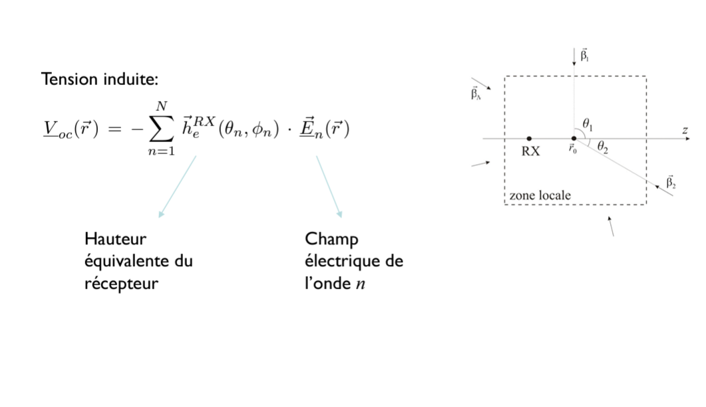
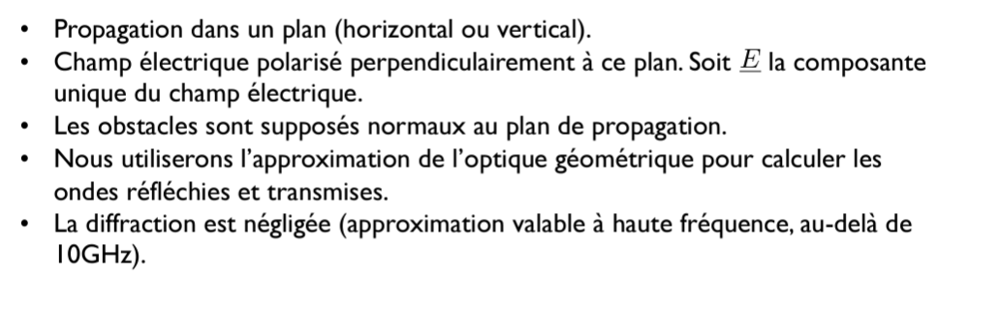
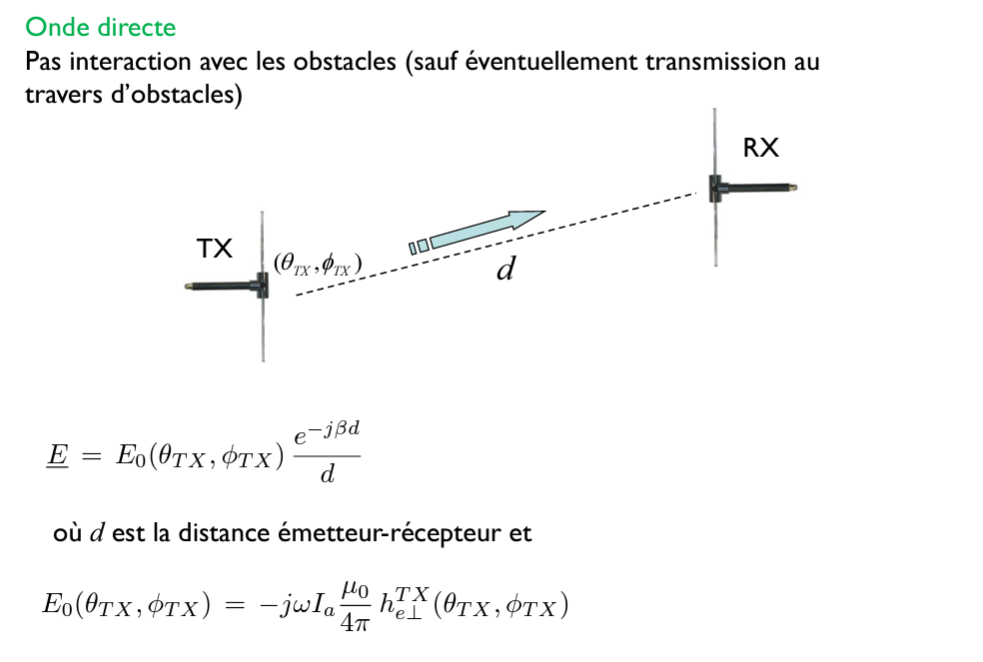
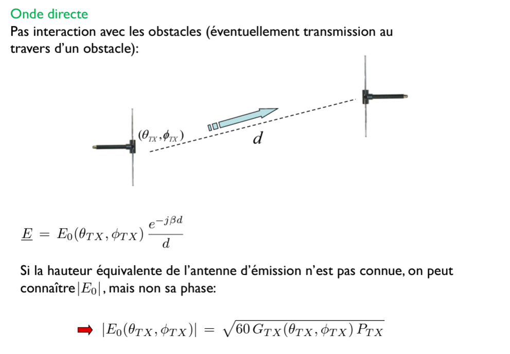
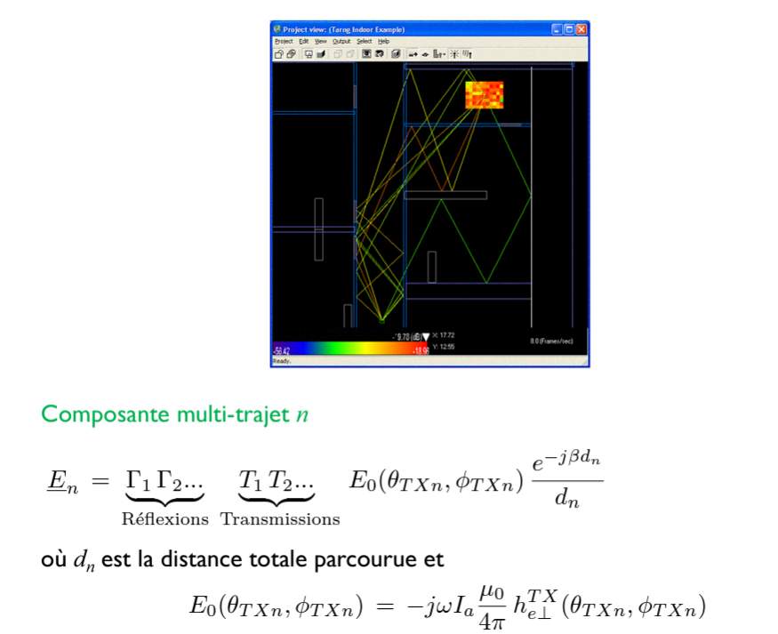
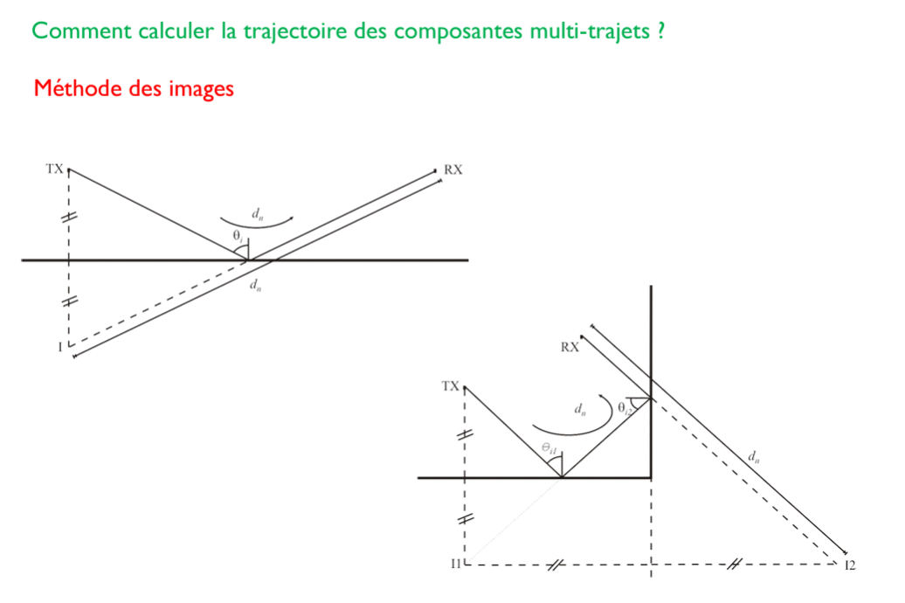
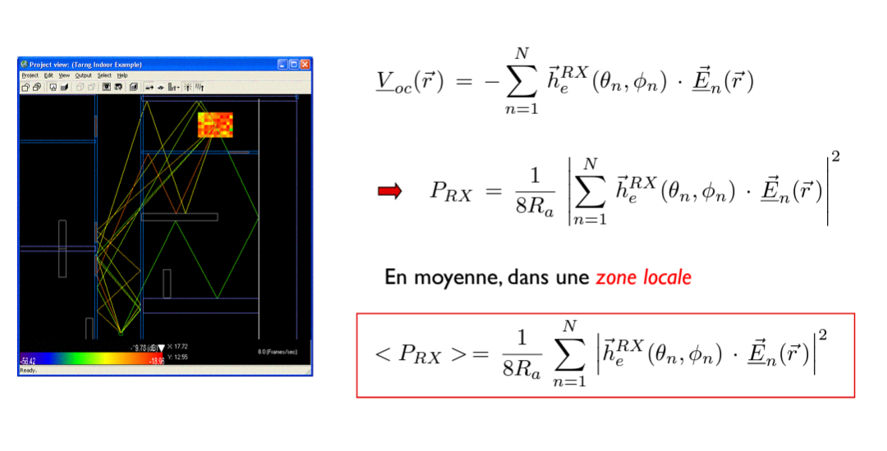

# ELEC-H304 PhysTel - cours 12 - 26/03/2024

## Chap 8 - Réflexion, transmission et diffraction

#### Rappels
rappels cours précédant  
Coeff de transmission $T$ et de reflexion $\Gamma$ d'un mur  

### Raytracing ( $\Rightarrow$ PROJET ! )
composantes multi-trajets (supposées localement planes)  

> projet: 60Ghz, longueur d'onde de quelques mm, donc diffraction ignorée car dimension mur >> $\lambda$ (dès que au dessus de genre 10GHz)  

  
Zone locale: les ondes planes seront identiques peu importe où l'on se trouve dans cette zone.  

Et avec la tension on pourra calculer la puissance reçue.  

> projet: antenne dipole $\lambda/2$  

#### Hypothèses simplificatrices
> pour pas que le projet dure 5000 ans.

  

#### Onde directe
> eventuelle transmission à travers des obstacles  

  

projet: pour nous $\theta_{TX}$ sera toujours égal à $\frac{\pi}{2}$  

  
on sait trouver le module de $E_0$.  
> c'est pas très genant d'avoir le cham pélectrique à une phase près  

#### Composantes multi-trajet n

  

#### Comment calculer la trajectoire des composantes multi-trajet ?
**Méthode des images**  

  

projet: $\Rightarrow$ soit implementer un code récursif qui fonctionnera de manière générique mais très long temsp de calcul, soit se limiter à 2 ou 3 réflexions (dans le projet on nous dit 2 réfléxions max).  

#### Grosse simplification (mais pas trop expliquée, c'est pour la MA1)
Puissance moyenne dans une **zone locale**:  
  
omnidirectionnel dans le plan horizontal: ici $h_e^{RX}$ ne dépend pas de $\phi$...  

> projet: on va calculer la puissance moyenne reçue par zone de 0.5m x 0.5m. (On utilisera le centre de la zone).  

Il y a aussi plein d'autres moyen d'optimiser le code...  

