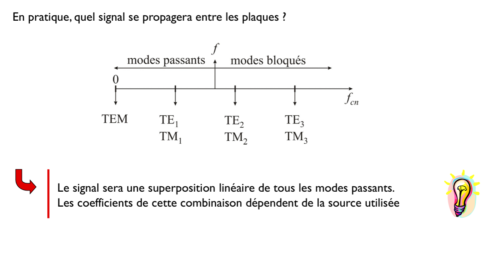

# ELEC-H304 PhysTel - cours 13 - 18/04/2024

## Chap 9 - Propagation guidée

on va voir d'autres types de dispositifs de lignes de transmission.  

### Propagation guidée

Les antennes rayonnnent (plus au moins) dans toutes les directions.  
C'est une bonne idée quand on sait pas où est le récepteur.  
Dans le cas où on connait la position du récepteur et du transmetteur, c'est pas optimum.  

Dans ce cas, on peut utiliser des guides d'ondes entre l'émetteur et le récepteur. (slide 4)  On limite les ondes dans l'espace vers le récepteur.  
// lignes de transmissions  

Ce chaptire, contrairement à celui des lignes de transmissions, on va dans l'autres sens, on part de la théorie des ondes, vers la théorie des circuits.  

Autres types de dispositifs pour guider les ondes:
- Dans des parois métalliques, une genre de tuyauterie  
  
L'onde rebondit le long de ce tuyau, et si métal de haute qualité, coefficient de réflexion très haut, donc très peu de perte. (dans le labo ils utilisent ça sur des petites distances). A chaque réflexions, il y a courant induit dans le métal du tuyau, donc un peu de perte.  
Lignes de transmissions sont limitées en puissance (sinon arc électrique), mais les guides d'ondes peuvent transporter beaucoup plus de puissance.  

- Fibres optiques: guides d'onde diélectriques  
  
On va vu qu'une onde peut subir un réflexion totale (il n'y a que l'échauffement diélectrique, qui peut être ramené très bas) à l'interface de deux diélectriques, c'est ce qui arrive théoriquement dans ces fibres optiques. On peut donc faire des fibres optiques très longues, de l'ordre jusqu'à des centaines de kilomètres.  

  
**Toutes les ondes ne puevent pas de propager dans un guide**.  
$\Rightarrow$ Un solution des éq de MAxwell pouvant se propager (càd satisfaisant les conditions limites) = un **mode**.  

Juste mettre une antenne dans un tuyau va pas d'office fonctionner. Il faut que la fréquence de l'onde soit adaptée à la taille du guide d'onde.  
Un guide peut être "**bloquant**", rien se propage.  
Un guide peut être "**passant**", un **mode** se propage.  

  
Fréquence minimale = **fréquence de coupure** : pour qu'un mode se propage dans le guide d'onde.  
Structure régulière, de période = **longueur d'onde dans le guide $\lambda_g$** (c'est une certaine périodicité que l'on observe, qui n'est pas la longueur d'onde habituelle)  

### Propagation entre deux plaques conductrices
On prend un cas académique, qui (il faut le croire) est bien généralisé pour d'autres cas.
  
Axe de transmissions: axe $z$.  
On a des conditions aux limites (là où se trouvent les plaques).  

Plutot que de résoudre Maxwell, on va...  
  
Onde plane se propageant dans la direction $z$.  
Il faut que l'onde ait un champ électrique polarisé dans la direction $y$ comme ça $E_z$ et $E_x$ est d'office nul aux plaques. Les conditions aux limites sont satisfaites automatiquement.  
C'est alors bien un mode de propagation qui fonctionne ici.  
**Mode Transverse Electro-Magnétique = mode TEM**  
Il es très important dans le lignes de transmissions (il fonctionnera pas dans les guides d'ondes ou dans les fibres optiques (on aura pas les conditions aux limites respectées aux quatres surfaces)).  

Autre idée:  
  
Il n'y a que le champs électrique qui est alors transverse:  
**Mode Transverses Electriques = mode TE**  

Même chose mais avec le champs magnétique:  
  
**Mode TM**  

Donc trois modes: **TEM**, **TE**, et **TM**.  

  
On aura mathématiquement que deux ondes planes (avec $\bar{E_1}$, $\bar{\beta_1}$ et $\bar{E_2}$, $\bar{\beta_2}$, la 3 serait en fait la même que la 1).  
On a $\beta$ qui est connu ($\beta = \frac{\omega}{c}$).  

> il a fait au tableau le calcul $\bar{\beta_1}.\bar{r}=\beta(-y\cos(\theta)+z\sin(\theta))$ comme $\bar{r}=$...  

Est-ce que je vais pouvoir injecter l'onde avec n'importe quel angle d'incidence $\theta$ ?  
  
$n$ numérote les angles possibles.
Il existe un infinité de solutions possibles, un infinité discrète.  
$\Rightarrow$ **le mode $\mathrm{TE}_n$**  

> Dès qu'on confine (par exemple ici les deux plaques) l'onde, on a alors une infinité discrète de solutions, plutôt qu'une infinité continue pour une onde libre (dans un espace libre). C'est mathématiquement bien expliqué.  

  
Si la fréquence est trop faible, l'arccosinus n'a pas de solution et donc pas de mode.  
Cette fréquence minimale est super importante: **Fréquence de coupure** de chaque mode. ($f_{cn}=\frac{nc}{2b}$)  

Mode TM:  
  
même chose, infinité discrète de modes $\mathrm{TM}_n$ et une fréquence de coupure $f_{cn}$  

  
Modes qui ont une fréquence de coupure plus basse que $f$ ($f_{cn}<f$) vont donc pouvoir propager, ils sont passant. (inversément pour les modes avec une fréq de coupure plus hautes que $f$)  

Combinaison linéaire de tous les modes possibles(càd qui ont un $f_{cn}$ plus basse que $f$) sera le signal.  

  
On peut voir les paquets d'ondes qui se propagent dans le guide d'onde (sur le troisième).  
On imagine un sinus dans le sens transversal (y) qui se propage dans l'axe z.  
La **longueur d'onde dans le guide** $\lambda_{gn}$ ne vaut pas juste la longueur d'onde dans le vide, mais divisé par $\sin(\theta_n)$ (theta n qui est l'angle par lequel j'ai injecté l'onde).  

  
Donc si $f<f_{cn}$, $\beta_{gn}$ aura une partie imaginaire, donc l'$e^{-j\beta z \sin\theta_n}$ de $\bar{E}_n$ aura une partie réelle donc l'onde va s'atténuer.  

  
Le motif qu'elle forme (le troisième là) semble se déplacer plus vite que la vitesse de la lumière. C'est la **vitesse de phase $v_{\varphi n}$** = vitesse de "déplacement" du motif.  

  
**Vitesse de groupe $v_{gn}$** = vitesse de transfert des informations.  
**Cette vitesse dépend du mode !** (c'est trivial)  
Elle dépend aussi de la fréquence, car l'angle change (car besoin pour respecter les conditions aux limites), on a plus ou moins de rebonds etc.

Si on envoie un combinaison de plusieurs modes, chaque mode arrive à un moment différent à l'antenne.  
Par ex: $\mathrm{TE}_1$ arrive en premier, puis $\mathrm{TE}_2$ etc...  
C'est le phénomène de dispersion temporelle, on reçoit toute une série d'echo d'un message qu'on reçoit. C'est ce qui limite les vitesses de transmission. On veut éviter ces phénomènes.  

$\Rightarrow$ on utilise alors toujours le mode TEM, qui va pouvoir se propager sur la ligne. Comme ça on évite le phénomène de dispersion temporelle. On limite alors la freq pour pas arriver au premiers autres modes.  
On regarde la fréquence de coupure la plus basse (au dessus de TEM) et on peut pas travailler au dessus de cette fréquence.  

> le mode TEM est le mode de base (et utilisé seul en monomode) qu'on utilise dans toutes les lignes de transmissions et les guides. $0<f<f_{c1}$  

