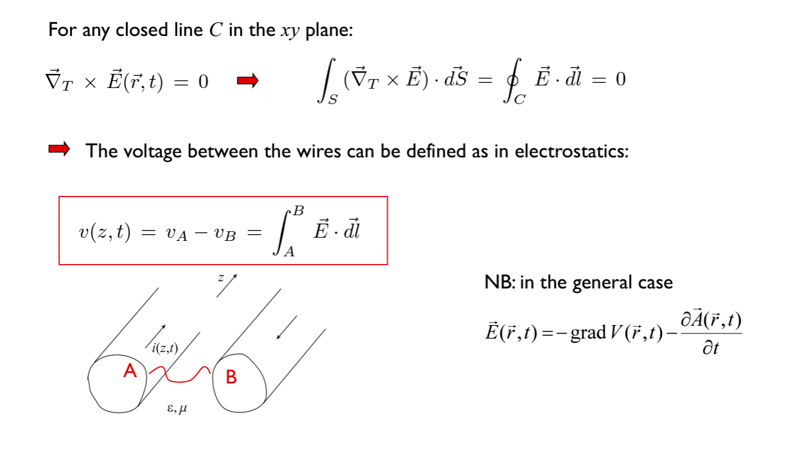
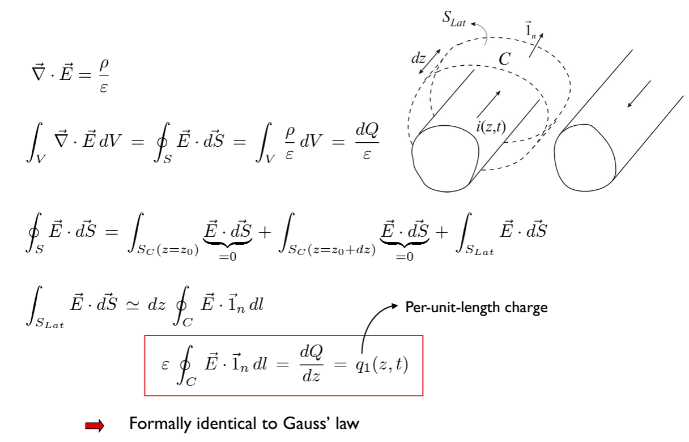

# PhysTel Cours 14 - 25/04/2024

### **2025: on traverse très rapidement le reste du chapitre car pas de temps**

## Chap 9. Suite

Hypothèse: **lignes de transmission homogènes** = elles gardent la même sections et la même distance entre elles tout leur long.  

### Field equations
On reprend le cas général:  
  
$E_z=B_z=0$ = TEM mode  
> aucune composante le long de la ligne  

Plongeosn dans les math:  
  
On isole cet axe z dans les eq de Maxwell.  
Lignes de champs se propagent dans la direction de z.  

  
Ces deux equations de Maxwell ont été éclatées en 4 équations (sera utile).  

  
On passe des 4 équations à mtn 6 équations, qu'on va séparer en deux groupes.  
À droite, bidirectionnels (selon X et Y, le plan transverse), à hauche, variations selon l'axe Z.  
Pourquoi cette séparation ? Celles de droites sont celles de la statique qu'on a vu en BA1. Et les deux de gauches modélisent le variations selon l'axe z (comment ces paquets/structure vont varier dans l'axe z).  

Prenons la première équation de droite:  
  
(On a utilisé Stokes)  
On a ce qu'on a appelé la différence de potentiel entre le point A et le point B.  
Ca parait trivial mais on est pas en statique ici! C'est parce qu'on est en mode TEM ici. On obtient les mêmes résultats qu'en statique. Ces lignes de champs vont se propager.  

  
> "C" type: entoure un seul conducteur ⚠️  

  
> $\bar{dS}$ élément de surface qui rentre dans l'écran.  

Comme on a vu en BA1, mais encore une fois ça parait trivial mais on est pas en statique! Encore une fois c'est parce qu'on est en TEM.  

  
> on avait défini ce $q_1(z,t)$ dans le chap 1  

  
> on avait défini ce $\phi_1(z,t)$ dans le chap 1  

### Line parameters
On va pouvoir définir ces paramètres des lignes grâce à ces équations:  
  
Définir/trouver l'éq de ces champs? En faisant en statique dans le plan transverse.  

### Propagation velocity

  
Maintenant regardons ce que nous donne ces deux équations de gauche.  

  
On obtient une équation de type Télégraphistes.  

  
On obtient une équation de type Télégraphistes.  

Les deux raisonnements (ici et chap1) doivent se rejoindrent:  
  
$$L_1C_1 = \varepsilon\mu$$  
$$v_p=\frac{1}{\sqrt{\varepsilon\mu}}$$  
**vitesse de propagation = vitesse de la lumière dans le diélectrique**  

> pratiquement: on s'en fout un peu de la vitesse à travers les cables, c'est déjà assez rapide, sauf pour de très longues distances genre trans-atlantique.  

> ici on a supposé que la gaine était d'épaisseur infinie autour du fil, sinon il y aurait un interface avec l'air avec des calculs difficiles qui sont pas nécessaire en pratique  

### Coaxial cables

  

On peut en déduire la cpacité du câble:  
  
On obtient $C_1$ à utiliser dans les éq des Télégraphistes  

  

On en déduit l'inductance par unité de longueur àpd flux par unité de longueur:  
  
On sait donc trouver l'impédance caractéristique de la ligne.  

> Montrer que ça fonctionne: exemple slide 45, 46  

ça cloture les lignes de transmissions.  

### Les guides d'onde métalliques
comme un tuyau  
  
**Le mdoe TEM n'existe pas**, il faut accepter ce postulat, dans quelconque guide d'onde métallique.  

par hypothèse, $a$ est plus grand que $b$ dans la géométrie du guide d'onde.  

#### Modes TE

  
> on a une éq différentielle avec conditions aux limites.  
> peut se diviser en trois équations selon les directions cartésiennes.  
> méthode de séparation des variables:  

  

  
on applique les conditions aux limites.  
> on a déf ici $E_{x0}=D$  

  
même raisonnement pour $\underline{E}_y$  
On peut numéroter les modes (avec deux indices: $m$ et $n$). Il y a une double infinité.  

$m$, $n$ caractérise un angle avec qui décrit un mode (une onde plane injectée avec un certain angle).  

On reprend Maxwell pour vérifier que ces solutions sont admissibles:  
  
On avait trouver $B$ et $D$, maintenant on a trouvé un lien entre $A$ et $C$.  

Pour le mode $TE_{mn}$:  
  
**Le mode $TE_{00}$ n'existe pas.** (sinon $\underline{E}$ serait nul)  

