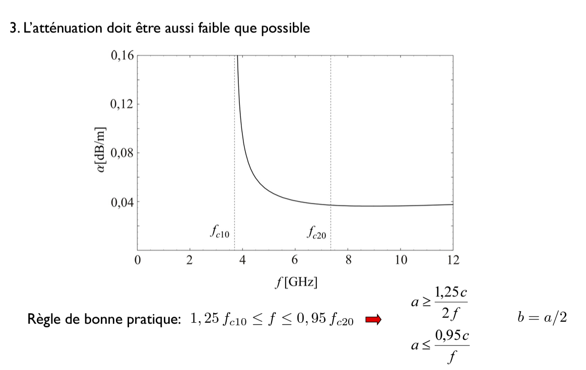

# PhysTel Cours 15 - 02/05/2024

## Chap 9. Suite

suite: slide 54  
### Les guides d'onde métalliques
#### Modes TE

  
Faut que $\beta_g$ soit réel (sinon atténuation exponentielle dans le guide d'onde).  
-> **fréquence de coupure** du mode $m$, $n$  

Mode $\mathrm{TE}_{00}$ n'existe pas et $a>b$ $\Rightarrow$ **Mode 'fondamental'** = $\mathrm{TE}_{10}$  

#### Modes TM
on fait ducoup avec $B_z=0$ et on trouve de même:  
  
Fréquences de coupure ont la même expression que pour les modes TE.  
Modes $\mathrm{TM}_{10}$ et $\mathrm{TM}_{01}$ n'existent pas, -> Mode TM le plus bas: $\mathrm{TM}_{11}$  
Ces modes TM ne seront pas importants:  
$\Rightarrow$ **Mode fondamental parmi tous les modes = $\mathrm{TE}_{10}$**  

- Ligne de transmission: toujours en Mode $\mathrm{TEM}$  
- Guide d'onde: toujours en Mode $\mathrm{TE}_{10}$  

#### Mode $\mathrm{TE}_{10}$
  
Forme sinusoïdale, nulle sur les parois ($x=0$ et $x=a$)  
Champ électrique intense au milieu qui décroit vers les parois supérieure et inférieure.  

  
aucune propagation dans la direction $E_y \times 1_z$.  
On voit qu'au final cette densité de puissance se propage bien dans la direction $1_z$.  
Puissance totale: suffit d'intégrer ce flux de vecteur de Poynting sur une surface.  
Pour une source donnée (/pour un $E_{y10}$ donné) je dois maximiser la surface (mais ça change la fréquence de coupure donc attention tradeoff).  

Autres contraintes:  
  
On a considéré les parois du guides comme parfaitement conductrices, mais en pratique elles ont une conductivité finie -> atténuation à chaque réflexion.  
Facteur d'atténuation par unité de longueur: $2\alpha$.  
Atténuation exponentielle: $P_r(z)=P_0 e^{-2\alpha z}$  

  
On utilise des champs dans le cas de parois parfaitement conductrices, en utilisant cette atténuation dûe aux parois conductrices non parfaites.  

  
> 2. // chapitres avec les réflexions.  
> 3. approximation de l'effet Joule: $\frac{|\underline{\bar{J}}_S|^2}{2\sigma}$  

et si on calcule $\alpha$:  
  
On voit un _exemple_ numérique de $\alpha$ en fonction de la fréquence.  
On a tout intéret de travailler plus loin que la fréquence de coupure du mode $10$.  

#### Dimensionnement
Comment choisir a et b pour transmettre de manière optimale?  
- modomode  
- puissance de source maximale possible  
- plus petite atténuation possible  

1. Monomode:  
  
mode $\mathrm{TE}_{10}$:$f>\frac{c}{2a}$ et $f<?$ checker $\mathrm{TE}_{01}$ et $\mathrm{TE}_{20}$  
Checker mode $\mathrm{TM}_{11}$  
$\Rightarrow$ entre mode $\mathrm{TE}_{10}$ et $\mathrm{TE}_{20}$ pour fonctionnement en monomode.  
> On veut rejeter le mode $\mathrm{TE}_{01}$ le plus à droite possible pour garder un mode monomode le plus large possible (il pourrait tomber entre TE $_{10}$ et TE $_{20}$), comme TE $_{10}$ et TE $_{20}$ sont fixés (TE $_{20}$ est le double de TE $_{10}$).  

  
2. Véhiculer la puissance la plus importante possible  

3. Atténuation la plus faible possible  
  
Essayer de se rapprocher le plus possible de la fréquence de coupure du mode $\mathrm{TE}_{20}$ mais pas trop (garder une marge de sécurité) pour les tolérances de fabrication (conventionnellement: 5% plus bas).  

Exemples:  
  

> ### Optical fibers / guides optiques / guides diélectriques
> 
> blabla, pas aux questions d'exam  
> 

# Exam:
réglement sur l'UV  

30min, sur place (en UB2 porte A)  
On a son portable (HDMI)  

deux parties:  
- 20min **max**: leçon (si tout clair c'est ok, sinon pose des questions tel un étudiant)  
- 10 min de _bonus_: sujet qu'on veut, soyez créatifs, faut de l'ingénierie là dedans, sous forme de slide aussi  

**idée PLucas**: mmWave movement/presence sensing (for people).  

8 questions:  
- si hypothèses: donner hypothèses  
- maths: montrer qu'on comprend les maths  
- dès que possible: donner une explication physique, un exemple, une application  

vraiment comme si on est un prof qui explique à un étudiant  

