# ELEC-H304 PhysTel - Cours 2 - 2024-02-06

## Chap2

source - ligne de transmission - antenne (modélisée comme une résistance)  

délai de propagation entre source et résistance(antenne)  

[animation] (ou slide 5 et 6)  

différentes lignes de transmission:
- coaxiale
- micro-ruban (sur PCB)
- bifilaire (2 fils parallèles)

on peut raisonner comme habituellement pour les zones de chaque coté de la ligne de transmission  

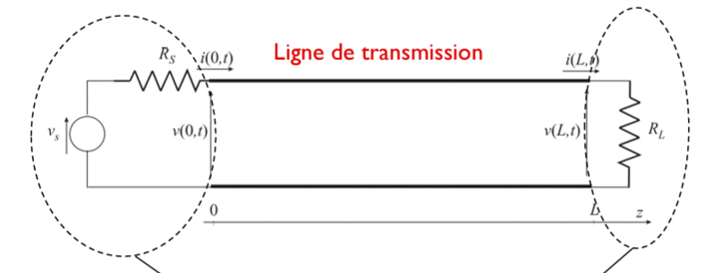

### Ligne infinie
la ligne "se charge"  
propagation de la ddp (entre les deux fils) le long de la ligne au fur et a mesure que la ligne se charge de proche en proche 

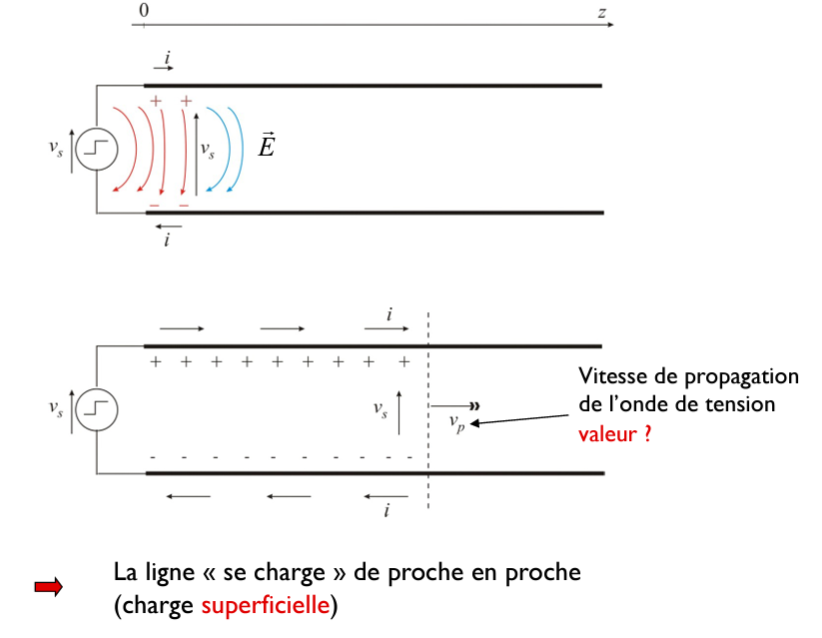

charges induites ont donc deux effets:
- ...  
- ...  

il y a un couple tension courant qui se propage le long du cable jusqu'au récepteur  

c'est pas les électrons dans la ligne qui se déplacent, mais bien le champ électrique qui se propage  

on ne connait pas la vitesse de propagation  

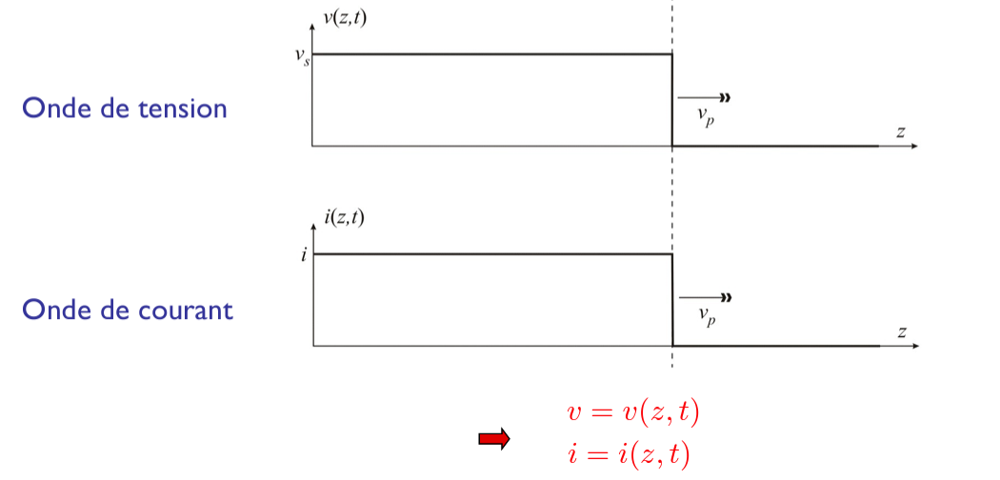

### Eq des lignes
Soit un tronçon infinitésimal: pas de délai: theorie des circuits classique applicable  
=> capacité du tronçon (=$C_1dz$)  
=> inductance du tronçon (=$L_1dz$)  
donc on peut faire un schéma équivalent du tronçon  
=> éqations (slide 15,16)  

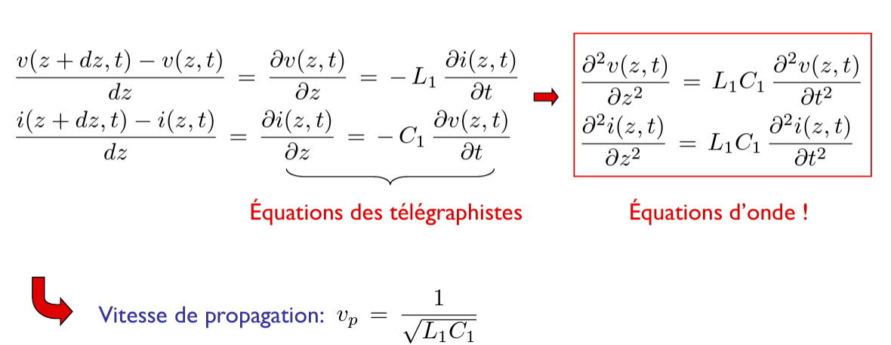
Équations des télégraphistes et **Équations d'onde**  
=> tension et courant se propagent comme des ondes dans les lignes de transmission  
=> vitesse de propagation: $v_p=\frac{1}{\sqrt{L_1C_1}}$  

Deux familles de solutions:  
- ondes progressives  
- ondes régressives  
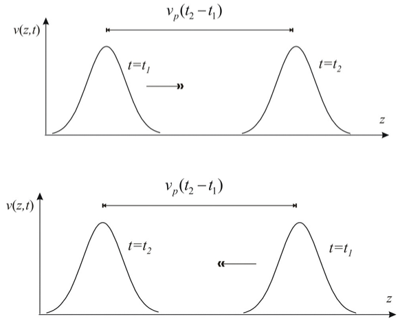

slide 18:  
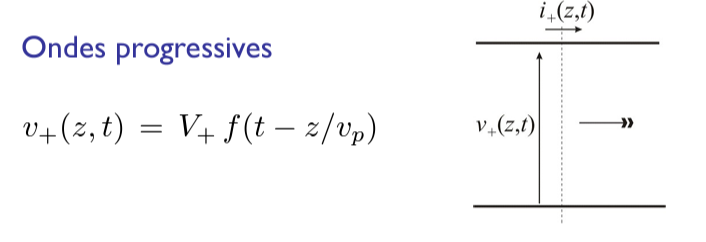

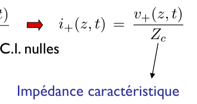

semblable pour ondes régressives...  

Impédance caractéristique:  
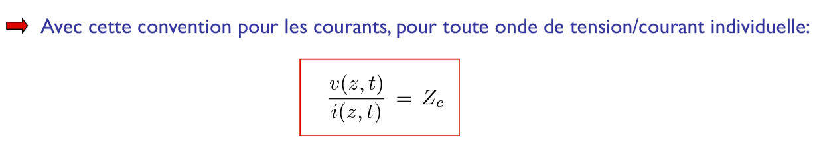

cas général: on voit que $i$ va dans l'autre sens, donc la mesure sera différente
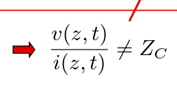

Interprétation de l'impédance caractéristique $Z_c$ ?  
Soot une ligne infinie -> uniquement onde progressive  
$\frac{v(z,t)}{i(z,t)}=Z_c$  
en particulier $\frac{v(0,t)}{i(0,t)}=Z_c$  

Deux situations équivalentes **pour la source**:  
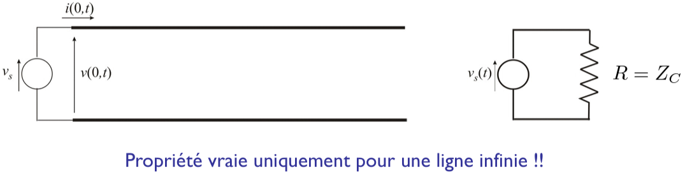
les deux sont indiscernables pour la source/générateur  

### Réflexions(/echos)

onde réfléchie  
ne peut avoir lieu qu'aux extrémités de la ligne  

à l'extrémité de la ligne, on peut utiliser la theorie des circuits classique  

- 1e cas: $R=Z_c$ : OK, pas de réflexion, ligne se comporte comme un ligne infinie  

- 2e cas: $R\ne Z_c$ : incompatibles, l'onde progressive est perturbée par $R$, **une onde réfléchie apparait**  

$\Gamma_L$ est le **coefficient de réflexion** à la (résisance de) charge:  
$$\Gamma_L = \frac{R-Z_c}{R+Z_c}$$  

- Cas particulier 1: $R=0$ (ligne courte-circuitée): slide 24  
- Cas particulier 2: $R=\infty$ (ligne ouverte): slide 25  

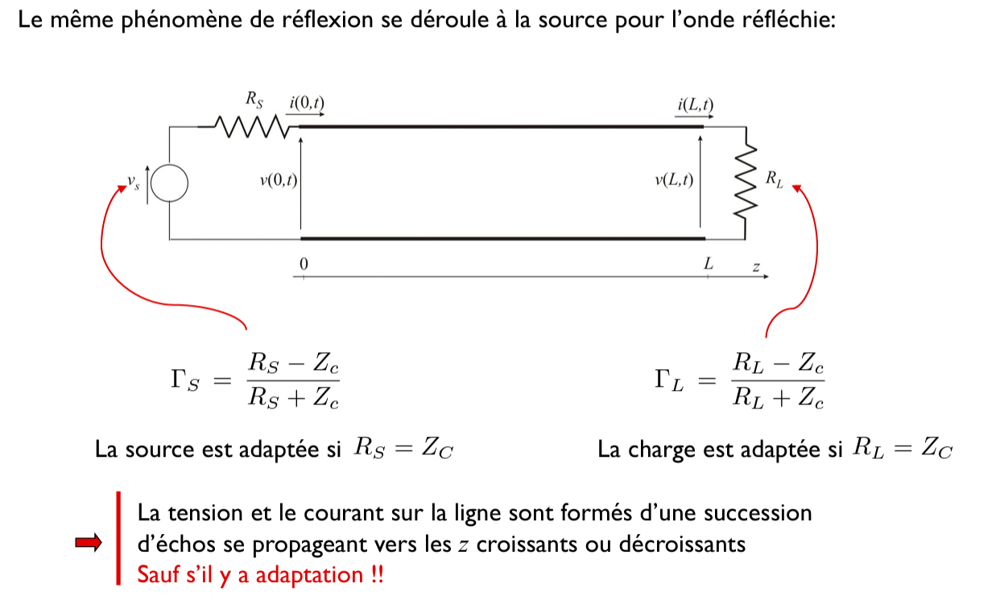

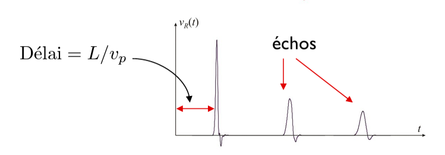

exemple slide 28:  
source DC, de resistance $R_S$  
résistance à l'extrémité de la ligne $R_L$  
- Résultat quasi-statique:  
...  

- Résultat "exact" (slide 29) :  
à l'instant initial, la ligne est équivalente à une ligne infinie pour la source  
=> équivalente à une résistance $Z_c$
SLIDE 29, 30, 32, 33, 34  
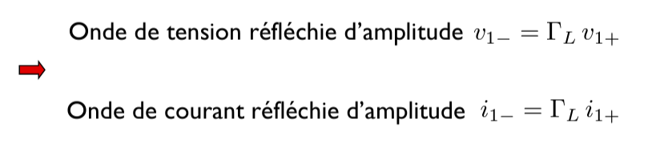
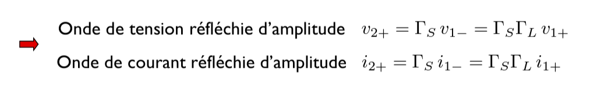

après un temps infini, on retombe bien sur la quasi-statique  

