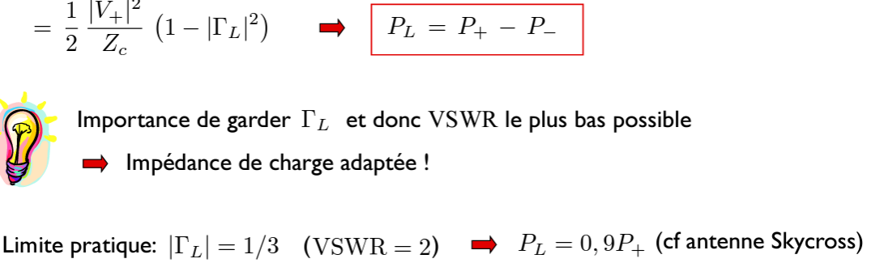

# ELEC-H304 PhysTel - Cours 3- 2024-02-20

## Suite Chap 2 - Lignes de transmission

### Rappel:  
réflexions (présence d'échos), délai de propagation, ...  

### Régime sinusoïdal permanent
on ne calcule plus le transitoire  
> $V_S$ amplitude de la source, $\phi_S$ sa phase et $\omega=2\pi f$ sa pulsation  

$v_s(t)=Re(\underline{V_S}e^{j\omega t})$ où $\underline{V_S}(x,t) = V_S(x) e^{j\phi_S}$  

> $\Rightarrow i(z,t)=...$  

  
ce sont les equations des telepgraphistes en phaseurs  
> on défini $\beta=\omega \sqrt{L_1 C_1}$ pour simplifier les eq  

Interpretation:  
_slide 37_  
Onde progressive et onde régressive  
On voit que un point d'une certaine tension se déplace en z au fil du temps, ce cosinus se déplace vers la droite  
On peut voir la périodicité $\lambda$ et la vitesse de propagation $v_p$  
  

$\tau = \frac{z}{v_p}$ = délai de propagation  
  

**Ces exponentielles modélisent le délai de propagation**  
Dès qu'on voit ces exp, on sait qu'on a un délai de propagation  

_slide 39_ :  
Si on a plusieurs ondes sur la ligne, on peut les additionner régressives et progressives, il suffit de considérer mathématiquement que une seule onde progressive et une onde régressive  

De même pour le courant (slide 40)  
$\Rightarrow$  
  
> où $\frac{V_+}{I_+} = \frac{V_-}{I_-} = ... = Z_c=\sqrt{\frac{L_1}{C_1}}$  

#### Comment caluler le courant et la tension ?
slide 41  
On a deux inconnues  

On a défini un coeff de rélfexion $\Gamma_L=...$ pour pouvoir simplifier $\Rightarrow Z_L=... \Rightarrow \Gamma_L=\frac{Z_L-Z_c}{Z_L-Z_c}$  

slide 42  
Il reste une inconnue  

...  

on a résolu le système  
On voit que si $\Gamma_L=0$ donc pas de réflexion en bout de ligne, $V_-=0$, soit pas d'onde régressive.  
Le $(1-\Gamma_L \Gamma_S...)$ au dénom de $V_+$, on le développe en série $\Rightarrow$ slide 43  
  
On voit que l'onde progressive est bien formée aussi (en plus de la tension initiale venant de la source) de l'infinité de rélfexions (de direction progressive)  

#### Impédance d'entrée (de la ligne)
slide 44  

par déf: $Z_{in}=\frac{\underline{V}(0)}{\underline{I}(0)}$  
Résultat quasi-statique: $Z_{in}=Z_L$  
Résultat "exact": ...  
  
**Impédance d'entrée dépend de la longueur de la ligne**  

- Cas particulier 1 (slide 45):  
$Z_L=0$, càd ligne court-circuitée $\Rightarrow \Gamma_L=...=-1$  
  
> en très petite longueur, quasi-statique: comportement inductif car petit circuit donc en gros c'est une spire donc logique comme une inductance  
> rappel: $\beta = \frac{2\pi}{\lambda}$ , donc ici $tg2\pi\frac{L}{\lambda}$

- Cas particulier 2 (slide 46):
$Z_L = \infty$, càd ligne ouverte $\Rightarrow \Gamma_L=...=1$  
  
> en très petite longueur, quasi-statique: comportement capacitif car petit circuit donc en gros c'est deux petites plaques metalliques donc logique comme un condensateur  

#### Ondes stationnaires
slide 47, 48  

slide 49  

slide 50:  
  
Voltage Standing Wave Ratio (VSWR)  
> =1 parfait, infini très mauvais  
  

#### Puissance transmise à la charge

  

slide 53  

  

#### Les pertes
modélisation lignes:  
  

slide 55  
**Atténuation exponentielle au cours de la propagation** (cosinus multiplié par $e^{-\alpha z}$)  

slide 56  
La puissance vehiculée par l'onde progressive décroît exponentiellement (multipliée par $e^{-2\alpha z}$)  

slide 57  
$\alpha$ ets généralement exprimé pour une longueur de $d$ mètres, et en dB:  
$\alpha_d$[dB] $=...=(20  \log e)\alpha d=8,686 \alpha d$  

exemple d'un cable coax slide 58  
> ici on voit que ça monte avec la fréq car effet pelliculaire  
_Rappel: atténuation de 3dB = atténuation d'un facteur 2_  

