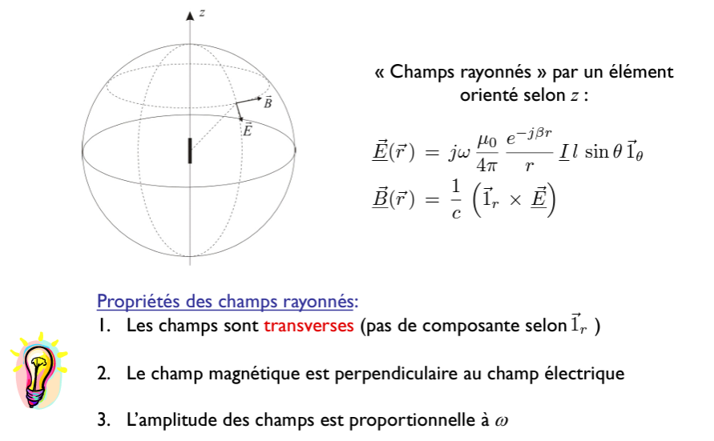
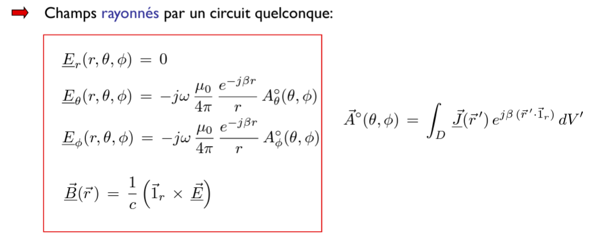
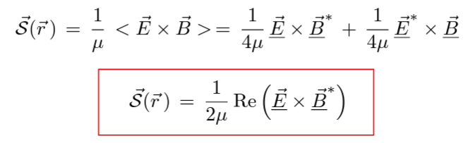

# ELEC-H304 PhysTel Cours 5 27/02/2024

> rattraper cours 4 (états variables, effet pelliculaire et début chap 4)

## Chap 4 - Émission et réception des ondes EM - suite

### Émmission

#### Champs rayonnés par un élement de courant

  

faut sommer ces dipoles, peu importe leurs orientations  

slide 12  
on peu généraliser selon une direction $\bar{1}_l$  
  

=>  
  
> (il ne faut PAS écrire $\bar{E}=-j\omega \bar{A}$ ! car c'est $\bar{\underline{E}}(\bar{r})=j\omega(\bar{\underline{A}}\times\bar{1}_r)\times \bar{1}_r$ )   

#### Cas général
> slide 14
circuit quelconque?  
faut sommer les champs produits par chacun de ces éléments de courant  
il faut calculer le potentien vecteur  

Plaçons-nous dans l'hypothèse $r>>D$  
un petit changement $r-r'$ (par rapport à la longueur) va provoquer un assez grand changement de phase (donc va être très sensible aux approx qu'on fait)  

Interférence entre tous ces petits effets des éléments de courant (contrsuctive ou destructive)  

slide 18  
On a réussi à factoriser les dépendances (séparer angles et distance)  
  
> Donc un fabricant peut par exemple se limiter à donner seulement les caractéristiques angulaires, qui seront valables à toutes les distances  

  
  

on peut rendre ça encore plus joli  
  

Slide 19  
Domaine de validité de l'approx ?  
  
D dimension caractéristique maximale du circuit  
$\Rightarrow$  
$$ r > \frac{2D^2}{\lambda}$$  

Région dans laquelle cette méthode est valabe = **région de champ lointain**  
  
$r_{ff}$  
Frontière champ proche/champ lointain  
> il faut bien vérifier les trois termes, mais ce sera très ouvent que le troisième qui posera problème  

  

### Théorème de Poynting

#### L'énergie électrique

  
> Énergie électrique est équivalente à l'énergie potentielle en mécanique (faire séparer des masses)  
> L'énergie est localisée dans le champs électrique  

#### L'énergie magnétique

  
> Énergie magnétique est équivalente à l'énergie cinétique en mécanique (faire accélérer une masse)  
> L'énergie est localisée dans le champ magnétique  

#### Discussion physique

  

> le seul ... c'est de dire que cette énergie est emportée par cette bulle rayonnée (elle va agir un travail sur les électrons au récepteur)  

Slide 25, 26  

#### Démonstration

Slide 27, 28, 29, 30, 31  
> travail uniquement produit par un champ éléctrique, un champ magnétique ne peut pas faire de travail  
- Dans un conducteur: le travail effectué(/la puissance donnée) c'est/donne l'effet joule  
- Dans une source: la source fournit de l'énergie grâce à une force d'origine non électromagnétique (chimique, mécanique,...)  

> petite propriété qu'on utilise: $\bar{X} \cdot rot\bar{Y} = div(\bar{Y} \times \bar{X})+\bar{Y} \cdot rot\bar{X}$  

$\Rightarrow$   
> Cette formule est donc démontrable mais dans pas beaucoup de cas pas utiles car on sait pas la puissance reçue au récepteur  

On déf le **vecteur de Poynting**  
  
> Ici on sait alors dans un point de l'espace, la puissance reçue par un récepteur  
> Celle-ci n'est pas démontrable mais donc beaucoup plus utile et est bien vérifiée expérimentalement à chaque fois  

Interprétation locale du vecteur de Poynting  
  
> à nouveau sans démonstration  

**Conclusions**:
1. L’hypothèse de localisation de l’énergie dans les champs est obligatoire, sinon il n’y aurait plus conservation de l’énergie.  
2. Tous les transferts d’énergie se font via le vecteur de Poynting. exemple: charge d’un condensateur, ligne de transmission,...  
  

> Les transferts d'énergie se font par flux autour des fils du circuits.  

#### Régime sinusoïdal permanent
Ce qui nous intéresse c'est la moyenne au cours du temsp du vecteur de Poynting: $\bar{S}(\bar{r}) = <\bar{S}(\bar{r},t)>$  
> slide 35  

  

slide 36  
Dans le champ lointain, pour les champs rayonnés dans le vide par un circuit quelconque:  
  
> on voit ici l'effet joule sous forme en phaseur  

#### Puissance rayonnée par un élément de courant
Slide 37  
La puissance rayonnée est indépendante de la sphère d’intégration (ouf !)  
La décroissance en $1/r$ des champs (et du propagateur) est nécessaire pour la conservation de l'énergie  
La puissance rayonnée dépend du module carré du courant  

représentation du vecteur de Poynting en diagramme polaire:  
  

