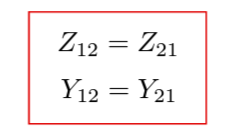
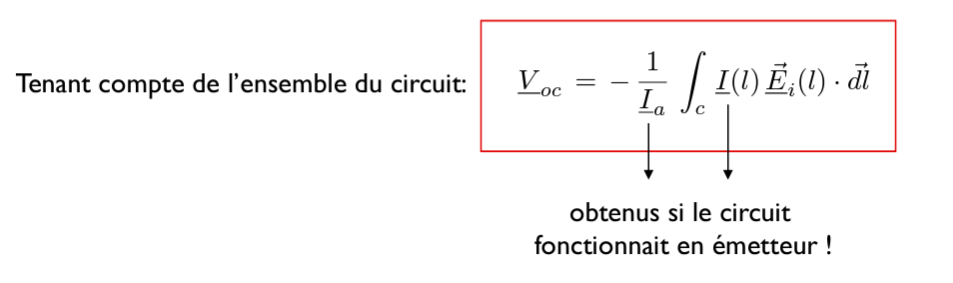
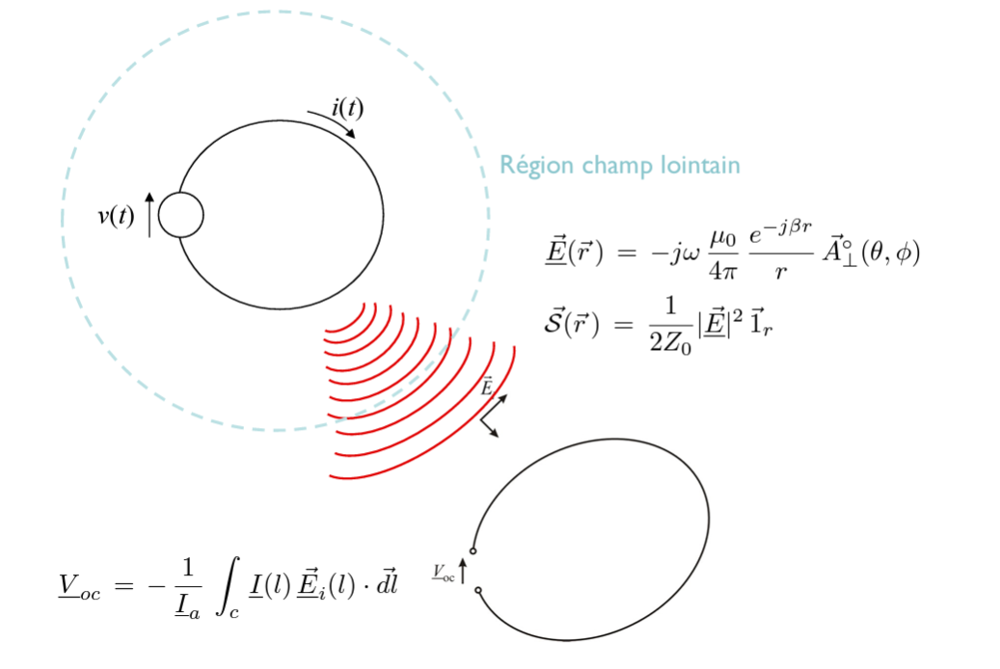

# ELEC-H304 PhysTel Cours 6 27/02/2024

## Chap 4 - Suite cours 5

### Réception

#### Théorème de récipriocité

  
> pas de démonstration  

> explique la réciprocité des communications sans fil  

#### Calcul tension induite
slides 42, 43, 44, 45  

  

### Conclusion

  
> approx dit que bulle tellement gonflée que le front d'onde est un plan, il sera alors intéressant de voir la formule mais le champ inscidant est une onde plane, ...  

La tension induite $\underline{V}_{OC}$ dépend de l'orientation relative du fil récepteur et de l'onde incidente (ce qu'exprime ce produit scalaire: $\underline{V}_{OC} = -\bar{h}_e(\theta,\phi)\cdot \bar{E}(0)$ $\leftarrow$ voir hauteur équivalente dans propriétés des antennes).  

