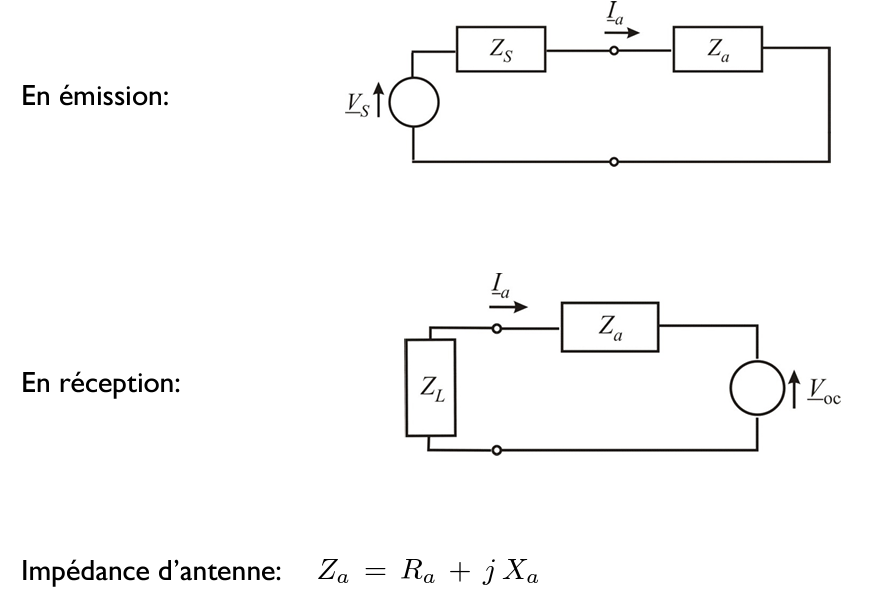

# ELEC-H304 PhysTel Cours 7 05/03/2024

## Chap 5 - Les antennes

Tout circuit alimenté en alternatif rayonne des ondes électromagnétiques. Les antennes sont des dispositifs qui permettent d'émettre et/ou de recevoir ces ondes électromagnétiques.  

Antennes dipoles, monopoles, antenne microstrip (en gros sur PCB), antenne réflecteur (parabole)...  

Réseau d'antennes (techno clé de la 5G) "Massive MIMO Beamforming"  
beamforming: jeux d'interférences constructives dans une direction et destructives dans une autre  
On joue sur le déphasage entre chaque antenne de la plaque  
  

**Diagramme de rayonnement** d'une antenne caractérise ses propriétés en émission et en réception:  
  
Pour calculer leurs propriétés, il faut connaitre le courant y circulant losqu'elles son alimentées.  
La difficulté est de définir ces courants. (on obtient numériquement le courant, avec maxwell, sur des logiciels)  
> exemple slide 6  

### Propriétés des antennes

#### Hauteur équivalente

**considérons une antenne en réception**  
onde plane incidente  
tension induite:  
  

$\bar{h}_e$ est la hauteur équivalente de l'antenne, dépend de $\theta$ et $\phi$  

  

on ne prend en compte que ses composantes transverses (car de toute manière on fait un prod scal avec $\underline{\bar{E}}(\bar{r})$)  
  

**mtn considérons en émission**  
  
> $\underline{I}_a$ est le courant injecté dans l'antenne  
> La hauteur équivalente est donc le gain(_**sûr?**_) divisé par le courant injecté  

**champs rayonnés par un circuit quelconque**:  
  

les propriétés tant en émission qu'en réception peuvent être déterminées à partir de $\bar{h}_{e\perp}$ (hauteur équivalente en comp perp)  

#### Schéma équivalent

  

Impédance: partie imaginaire, représente la partie réversible qui se passe sur un système, partie réelle, représente la partie irréversible du système  
  
> **résistance de rayonnement**: résistance qui représente l'énergie rayonnée (en onde émectromagn) par l'antenne  
> **résistance ohmique**: résistance qui représente l'énergie dissipée par effet joule dans l'antenne  
> **rendement antenne**: puissance rayonnement sur puissance totale consommée  

Donc la résistance de rayonnement de l'antenne dépend de l'environnement proche de l'antenne (par exemple une boite metallique qui empeche les ondes de se détacher -> modifie la valeur de cette résistance)  

> exemple slide 15  
> la longueur de l'antenne est non-négligeable face à la longueur d'onde  

#### Puissance collectée à la charge

  

On se met dans un cas particulier:  
  
> **Surface équivalente**: puissance max collectée à l'antenne sur la densité de puissance transportée par l'onde incidente. (dépend de la direction d'incidence)  
> cette surface n'est pas liée à la longueur de l'antenne (contre-intuitivement)  

  

#### Directivité et gain

**Il est impossible de concevoir une antenne rayonnant de façon isotrope!**  
  
> **Intensité rayonnée**: puissance rayonnée par l'antenne par unité d'angle solide, ne dépend plus de la distance.  

  
> **directivité**: informe sur la capacité de l'antenne à rayonner dans une direction privilégiée  
> intégrale totale de la directivité donne 4$\pi$, puisque l'intégrale de U donne la puissance totale rayonnée par l'antenne ($P_{ar}$)  
> **Gain de l'antenne**: indique la capacité de l'antenne à concentrer l'énergie rayonnée dans une direction privilégiée.

En réception, le fabricant nous donne $A_e$, en émission, il nous donne $G$.

> Il est **impossible** qu'une antenne soit **isotrope**, c'est à dire qu'elle rayonne de la même manière dans toutes les directions. Elle peut être **omnidirectionnelle**, ce qui veut dire isotrop mais **dans un plan**!  

Remettons tout ensemble:  
  

#### Relations de réciprocité
**!!/!\\!!**  
  
Surface équivalente est donc propotionnelle au gain.  
donc s'il on connait l'un, on connait l'autre.  

La surface équivalente dépend de la longueur d'onde(au carré) $\Rightarrow$ à haute fréq, il est difficile de recevoir des ondes.  

Une technique est d'utiliser une antenne parabolique, on augmente artificiellement la surface équivalente (grâce aux propriétés géométriques de la parabole).  
On a donc une réception plus élevée grâce à cette astuce.  

#### Diagramme de rayonnement

  
> peut etre 2D, 3D ?  

> _il a skip les trucs entre ici_

### Bilan de liaison en espace libre

  
On commence par trouver le vecteur de Poynting (densité de puissance incidente sur l'antenne réceptrice), puis on trouve la puissance reçue (adaptation parfaite et polarisation adaptée). Puis on obtient la formule de Friis :  
  
> (en réalité cette formule n'est correcte que dans des conditions parfaites, etc...)  
> puissance reçue diminue avec la longueur d'onde.  
> on va plus utiliser haute fréq pour courte distance et basse fréq pour longue distance.  

