# ELEC-H304 PhysTel - Cours 9 19/03/2024
> cours seulement de 9h à 10h  

## Chap 7 - Les milieux diélectriques et conducteurs

> On se limite aux milieux non-magnétiques.  

### 7.1 Discussion physique

#### Les milieux diélectriques
> diélectriques veut dire isolants  

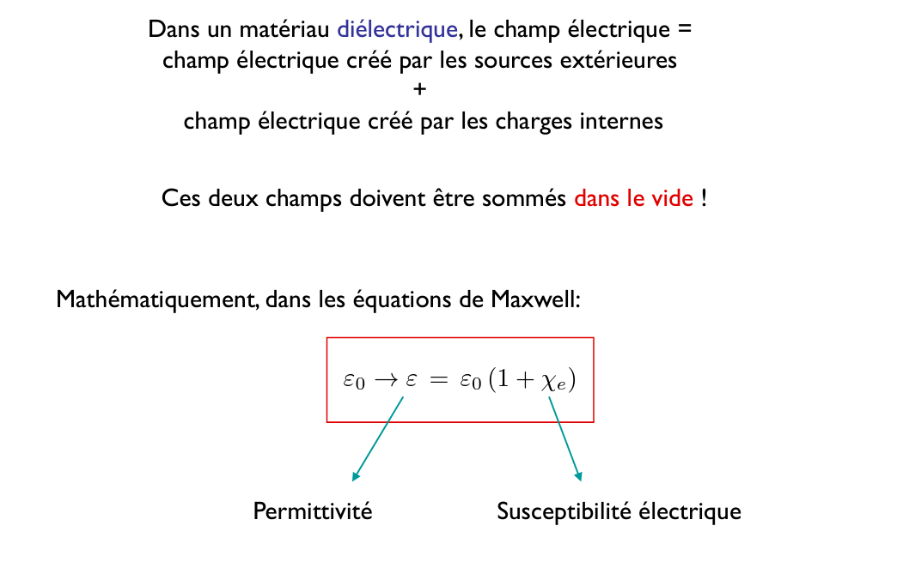  

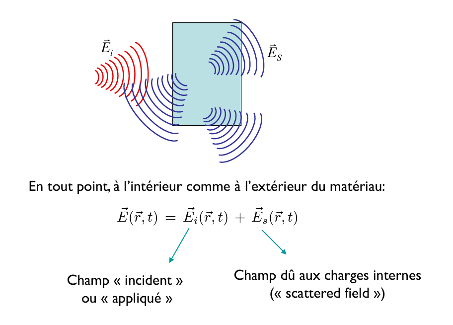  
si on envoie une onde sur un matériaux, l'onde incidente, elle va exercer une force sur l'ensemble des charges dans ce matériau, l'obstacle va lui même émettre une onde électromagnétique (dû à l'oscillation de dipôles à l'intérieur du matériau) => addition champ incident $\bar{E}_i$ (ou appliqué) et champ émis dû aux charges internes de l'obstacle $\bar{E}_s$ (scattered field).  

> le champ incident n'est âs nécessairement atténué à l'intérieur du matériau (?)  

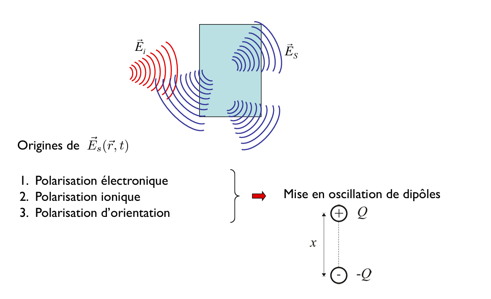  
1. polarisation électronique  
2. polarisation ionique  
3. polarisation d'oriantation (différence de position des charges positives et négatives)  
On appelle $x$ la distance entre les charges positives et négatives.  

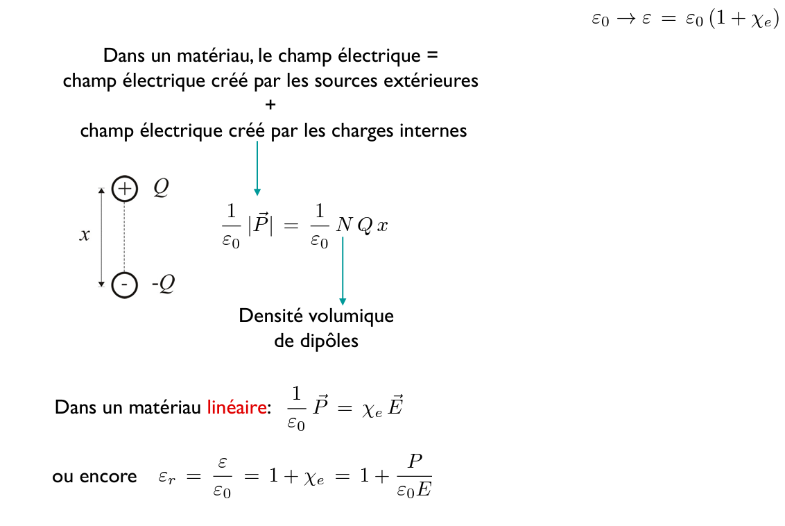  
_Dans le matériau linéaire_: attention ici c'est le champ élec total $\bar{E}$.  
On définit la permittivité relative.  

Que se passe-t-il à haute fréquence? :  
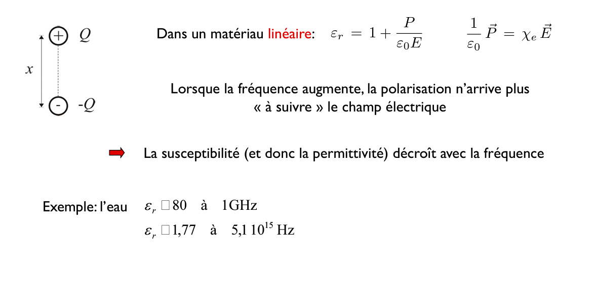  
> bug pdf: $\epsilon_r =$...  
_attention intuition: par ex eau transparent à lumière mais bloque nos ondes à nos fréq ici, mais mur laisse passer._  

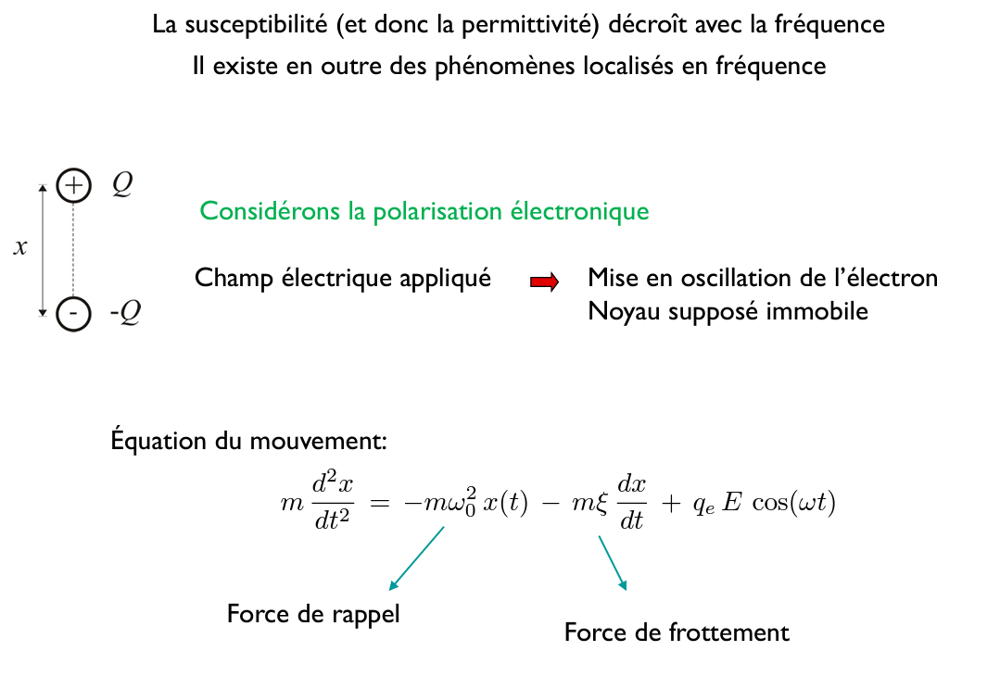  
On peut avoir une intuition par la mécanique classique (oscillateur harmonique) pour comprendre la résonance. On peut supposer, comme le noyau est bcp plus massif que l'électron, que seul l'électron bouge et que le noyau est fixe.  
Le champ électrique appliqué va exercer une force sur l'électron, qui va le mettre en oscillation (et noyau immobile).  

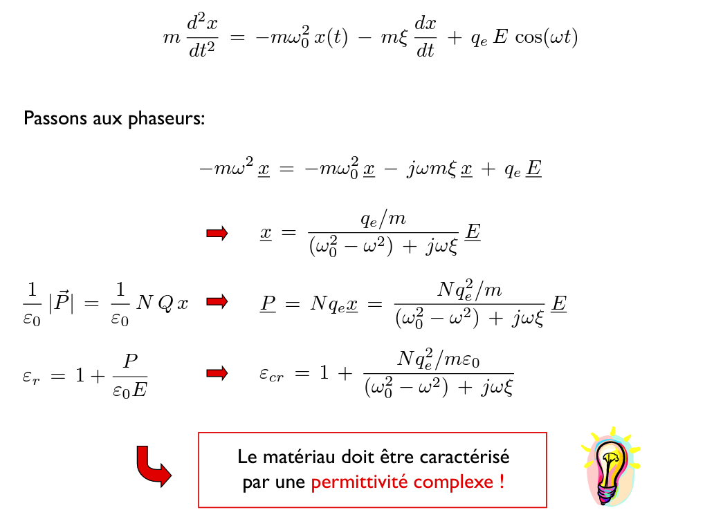  

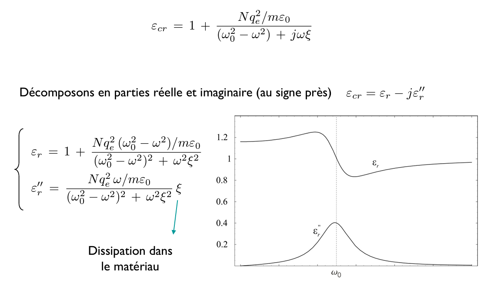  
Cette énergie (partie imaginaire de la permittivité?) doit être dissipée sous forme de chaleur (comme dû à un frottement). Ex: comme un micro-onde.  
Phénomène de résonance pour la partie imaginaire de la permittivité.  

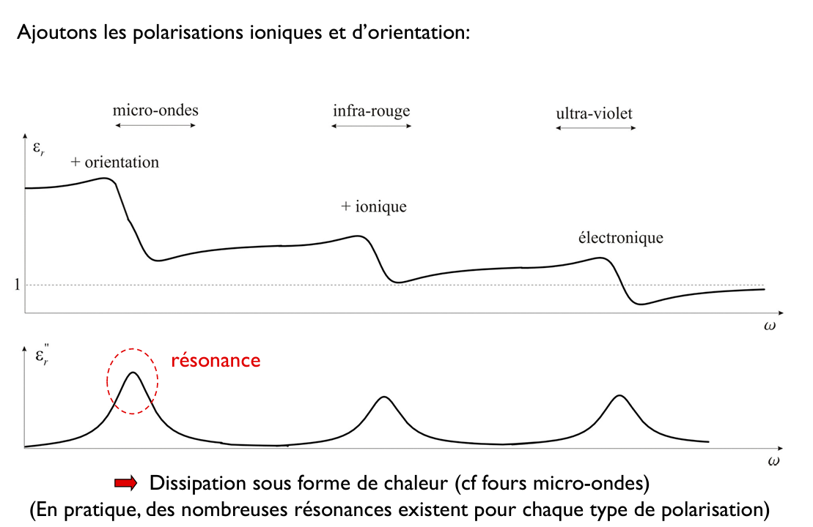  
Plus la fréquence descend, plus il y a de types de polarisation qui peuvent intervenir (électronique, puis électronique+ionique, pui électronique+ionique+orientation).  

Exemple absorption de l'air atmosphérique:  
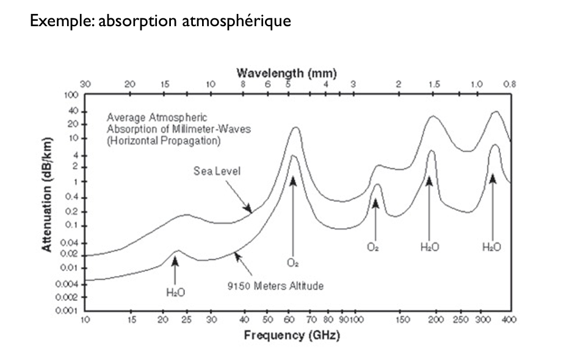  
> ex: grande absorption à 60GHz dû à la résonance de l'oxygène.  

Ex sur une plage de fréquence plus large:  
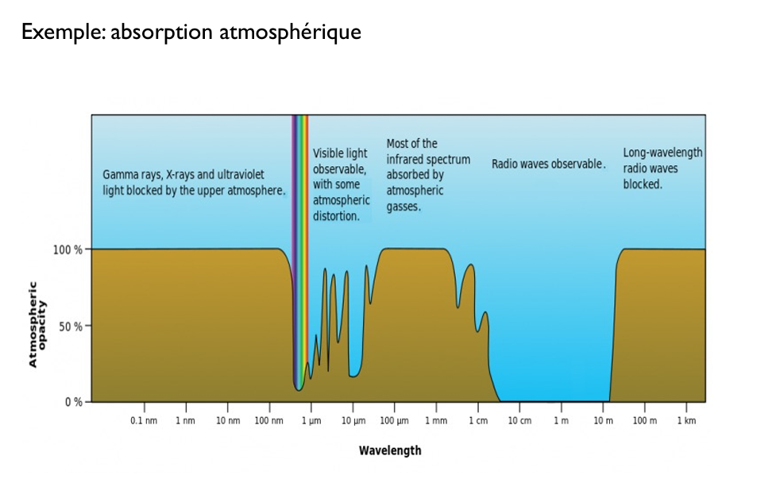  
> 1GHz = 30cm de longueur d'onde  

#### Les milieux conducteurs
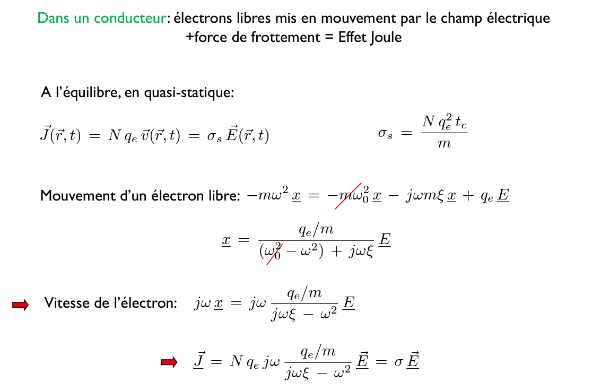  
On supprime le terme de rappel ($-m\omega_0^2\underline x$) comme l'électron est libre.  
Le coeff de porportionalité $\sigma$ est maintenant complexe, et non réel comme en quasi-statique.  

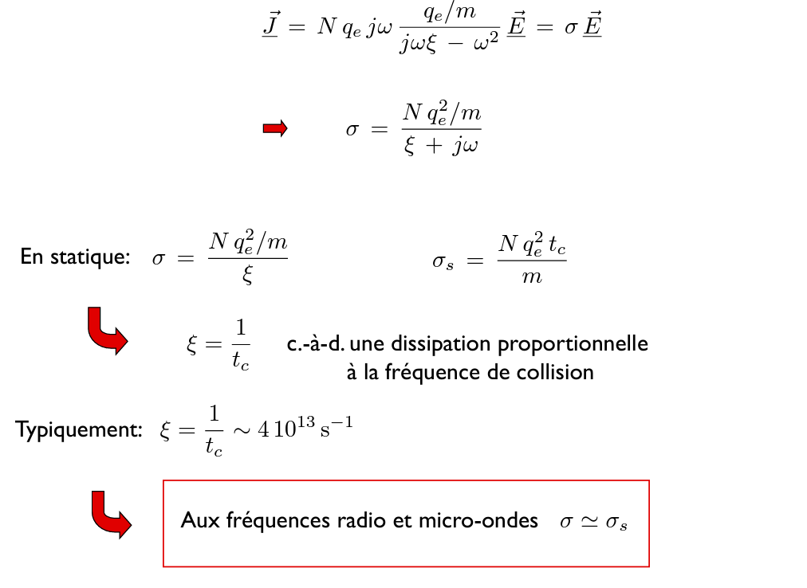  
C'est tout à fait intuitif de dire que la dissipation est proportionnelle à la fréquence de collision.  
On va pouvoir faire la simplification que aux fréquences radio et micro-ondes: $\sigma \simeq \sigma_s$ (le terme en $\omega$ est négligeable)  

> le matériau réagit linéairement au champ électrique qui lui est appliqué.  

#### Les plasmas
Il y a un plasma que l'on ne peut pas ignorer en télécoms, l'ionosphère.  
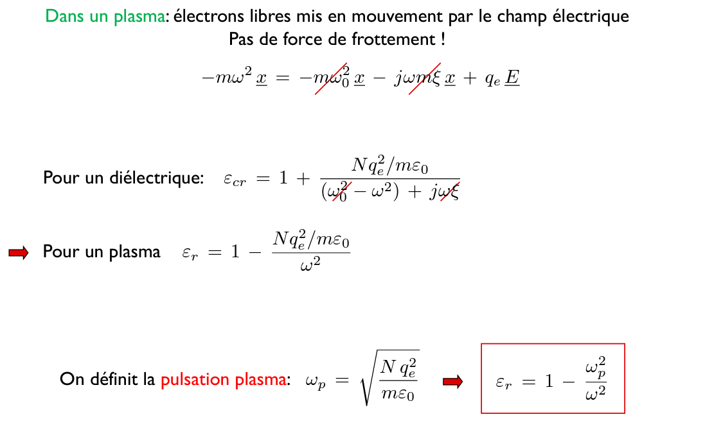  
On fait une deuxième simplification: comme c'est un gaz, les électrons libres ont très peu de chance de rentrer en collision avec les autres molécules/atomes de ce gaz. Le taux de collision se rapproche de zéro.  
Cette permittivité réelle peut être positive ou négative, en focntion de la fréquence de l'onde qui arrive sur ce plasma.  
> c'est un cas particulier de la permittivité complexe du point d'avant en fait.  

