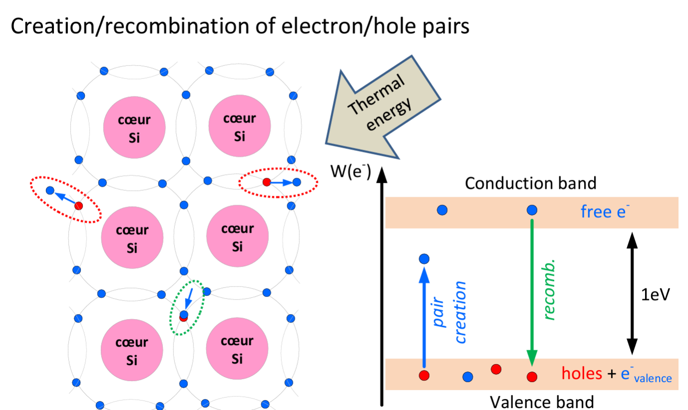
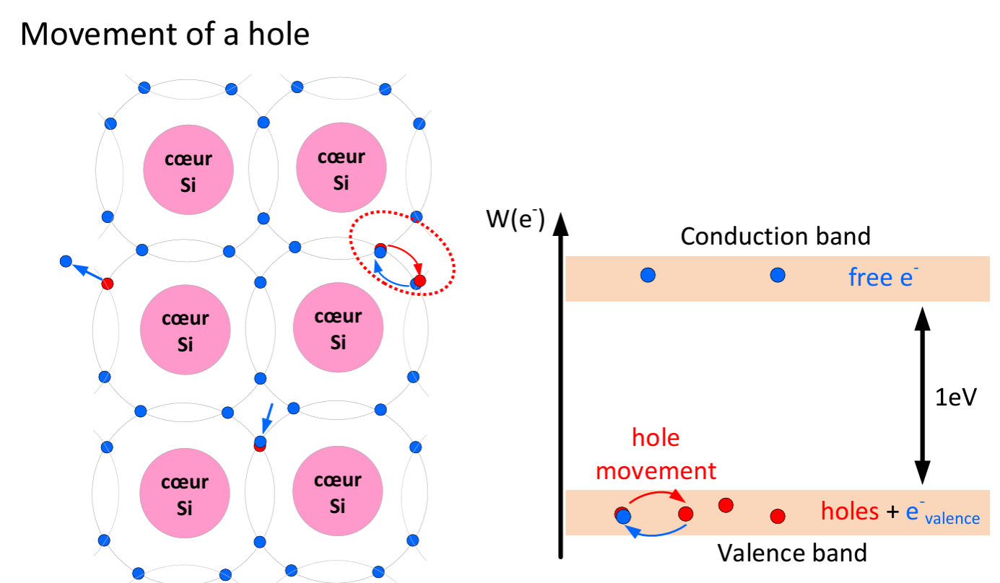
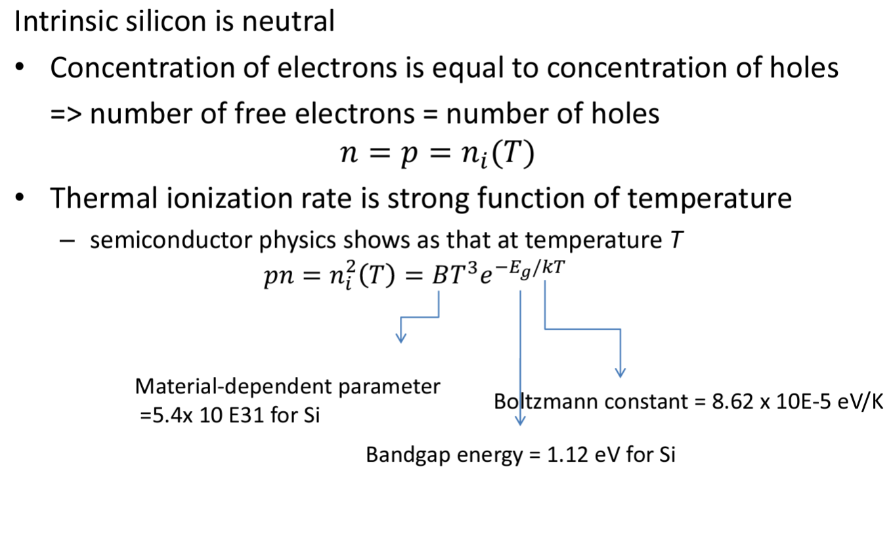
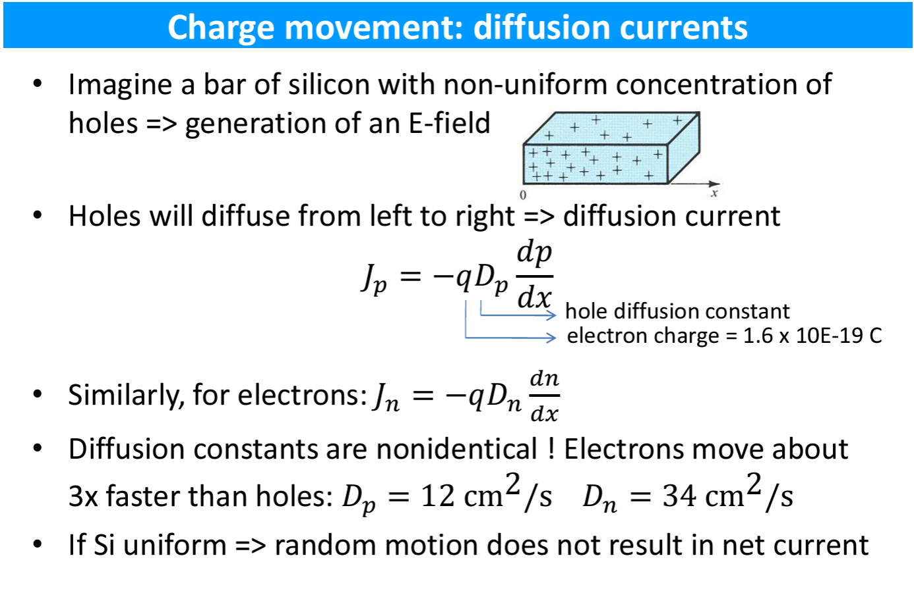
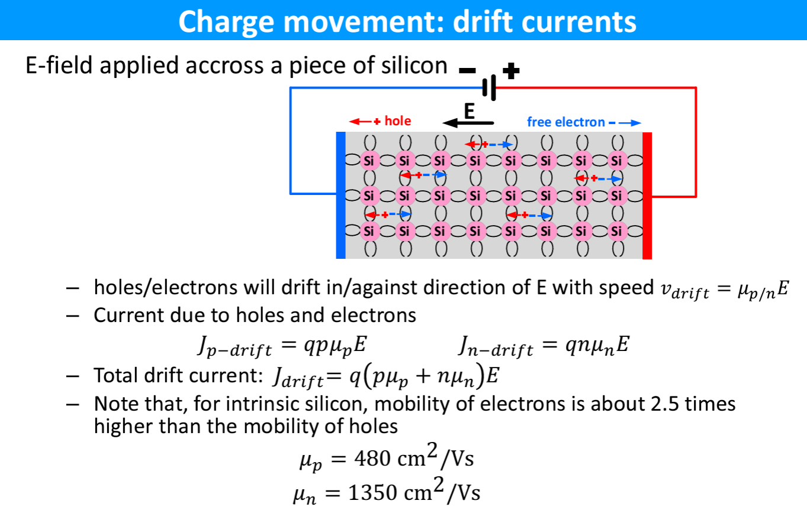

# Chap 1 Analog: Semiconductor basics

Matériau: on utilise Si pour ce cours  
Le cristal a une structure régulière  
Lien covalent (4 électrons de valence par atome de Si)  

Electron libéré à 300K => se déplace dans le cristal  
Electron absent => trou  
  
  

Si intrinsèque: matériel dit bipolaire.  
2 types de porteurs de charge:  
- **Negative**: free electrons moving through cristal  
- **Positive**: holes moving through cristal  
=> l'ionisation thermique crée des paires électron-trou  

  
autant d'électrons que de trous (le nombre dépend de la température)  
=> on a une formule.  

## Mouvement de charge:
- **Diffusion**: mouvement aléatoire des électrons et des trous, par agitation thermique  
- **Drift**/dérive: mouvement des charges sous l'effet d'un champ électrique à travers le Si  

### Courants de diffusion
  
Si Si uniforme, ça ne provoque pas de courant net.  

### Courants de drift/dérive
  
Vitesse de dérive proportionnelle au champ électrique.  
> $\mu_p$ constante de mobilité (des trous).  

