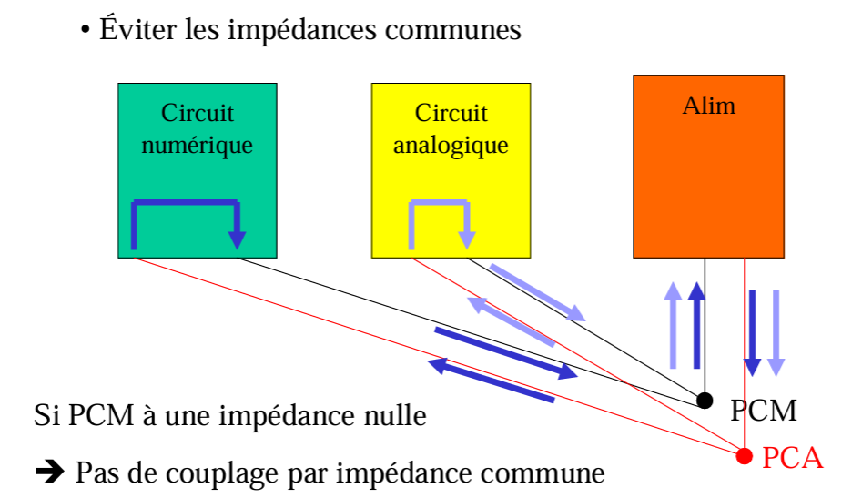

# Instru cours 12/03/2024

### Limitation du bruit

2 moyens:
1. augmenter le signal => amplifier  
    pré-ampli
2. réduire le bruit  

#### règles de base
1) cible le type de bruit
2) s'attaquer au bruit prépondérant
3) s'attaquer au bruit dès que possible

#### principales techniques
- au niveau des composants  
    - composants à faible bruit
    - paramètres qui influence directement le bruit (ex: température pour bruit thermique)

- au niveau du système  
    - préampli faible bruit
    - réduire bande passante du signal
    - réduire resistance de source
    - détection synchrone pour bruit rose

### réduire bande passante
bande de freq de source de bruit virtuellement infinie  
bande passante B du dispositif de mesure limitée  
=> le bruit perçu est limité à cette bande passante  

cas du bruit blanc: slide 32  

> slides 33, 34 : dispositif réel  
> bruit composite, freq de coupure, valeur efficace du bruit

### résistance de source
$R_S$ résistance de sortie du capteur  
il faut choisir:
- un ampli à faible **tension** de bruit quand $R_S$ est faible
- un ampli à faible **courant** de bruit quand $R_S$ est élevée

### étage d'entrée à faible bruit
> slide 36, 37  

Ampli unique...  
Ajout d'un étage d'entrée à faible bruit...  
Bruit total à la sortie...  
**le bruit d'un ampli est minimisé en plaçant en tête un préampli à faible bruit et de gain suffisant**  
> réalisation pratique...  

_exemple et calcul au tableau_  

### détection synchrone
éviter le bruit en $1/f$ (donc problématique à basse freq soit qlques Hz)  

principe: transposer momentanément le signal utile à une fréquence plus élevée, de manière à réaliser la transmission ou l'amplification en dehors de la bande bruitée  

moyen: modulation d'amplitude  

#### principe
  

  

-----------

## 3.2 Parasites
venant de l'environnement extérieur  

3 composantes:  
- source  
- couplage  
- victime  

contres mesures possibles à chaque niveau  

### parasites électromagnétiques (eq Maxwell)  

  

  

#### principales sources
slide 9  

### Parasites rayonnés - Couplage capacitif
> Deux conducteurs chargé et un isolant font une capacité  

Domaine du champ proche  

  

#### Contres-mesures
- disposer les conducteurs judicieusement: eviter lignes parallèles, les éloigner  
- blindage électrostatique  

#### Cas particulier: décharges électrostatiques
  

### Couplage inductif
> Lenz: champ magnétique variable induit dans un conducteur une fem qui s'opposer à cette variation  

Domaine du champ proche  

  

#### Contres-mesures
- éloiger les sources de champs magnétiques  
- minimiser la surface offerte au champ magnétique extérieur  
- blindage magnétique  
remarques: mode de couplage le plus répandu, tout boucle formée de conducteurs est une victime potentielle  

#### cas particulier: cables de transmissions

  

### Couplage électromagnétique

slide 19, 20  

### Blindages

#### blindage électrostatique (champ proche)

  

#### blindage magnétique (champ proche)
  

#### blindage électromagnétique (champ lointain)
  

### Parasites conduits
#### = couplage galvanique
  

#### origine physique
  

  

#### 2 niveaux de conséquences
  

#### Contres-mesures
  

  

  

#### exemples: circuit électroniques
slide 36, 37, 38, 39

#### Remarque: isolation galvanique
  

### Agencer l'alim et la masse
#### cablage de la masse
  

#### Interconnexion des circuits
  

#### cablage de la masse analogique
Masse en étoile ou masse en cascade ?  

#### Masse en étoile
  
Avantages: pas d'impédance commune  
Désavantages: longueur des pistes et formations de boucles  

#### Masse en cascade
-> une seule ligne de masse  
mais où placer "la source" de la masse?  
=> à la fin du circuit  
Comme ça on minimise le bruit au début de la chaîne analogique[?]  

#### Cablage de la masse numérique
En Haute-Fréquence, l'effet selfique des câbles devient prépondérant  
- les pistes ont une grande impédance  
- les courants passent par les capacités parasites  

massen en étoile => **plan de masse**  
- minimise les inductances  
- minimise les boucles  

#### CAN et CNA
  

  

#### cablages des alimentations
  

en gros on rajoute des capa (pour filtre pass-bas)  

