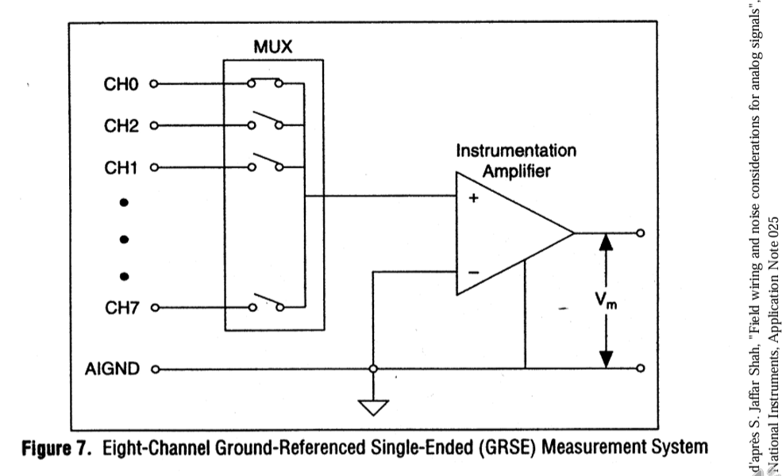

# Instru ELEC-H314 - cours 6 19/20/2024

## 3.2 Parasites
### Compatibilité électromagnétique
#### exemple: alimentation à découpage
Campagne de tests: appareils testés en émissions et en immunité  
Dispositif de test en extérieur, en chambre de faraday  

Attention en extérieur, niveau de bruit de l'appareil de mesure (venant de rayonnement externe genre radio, TV, etc)  
=> Test avant et après la mise ne marche de l'appareil à mesurer.  

## 3.3 Câblage et connexions

### Référence d'un signal

"tension", masse  

1. impédance de masse  

2. plusieurs montages  

  

### Terre = sécurité

si défaut dans l'appareil...  

### Montage "single-ended"

#### 1) cas idéal
  
> système qui va en général donner de mauvais résultats  

  

#### 2) cas réel
  
> => situation dégueu  

  

Qu'est-ce qu'on fait alors?
### Montage différentiel
#### Principe
  

#### Mode commun et mode différentiel (déf)
  

#### Cocnlusion: avantages et inconvénients
  

#### Remarques
  

### > Montage "single-ended"
#### montage single-ended + multiplexage
  

### > Montage différentiel
#### montage différentiel + multiplexage
  

### Symétrie des voies d'amenée

#### déséquilibre série
  
> impédance d'entrée grande  

  

#### déséquilibre parallèle
  

  

  

#### déséquilibre parallèle: garde
  
> diminue l'impédance d'entrée, que faire ? on ne relie alors pas le blindage à la masse mais à une tension donnée $\text{v}'_{\text{mc}}$: celle du mode commun. Donc on est virtuellement en circuit ouvert au niveau du blindage.  

### Montage différentiel avec $\text{v}_{\text{mc}}$ élevée ($\text{v}_{\text{mc}}$>>)
  

#### Solution n°1
Limiter la tension de mode commun  
  

#### "bias resistors" pour source flottante
  

#### Solution n°2
"ampli d'isolation"  
  

### Conclusion
  

  

