# Labo 2 Instru

## Partie 1

**Facteur de qualité Q**: amplitude de la fréquence de résonance du filtre (à quel point le pic est haut juste avant le roll-off)  
lié au facteur d'amortisseent  

**Filtre de Bessel**: très mauvaise réponse en module, mais la phase est linéaire dans la bande passant (donc toutes les freq sont shiftées du même délai)  
**Butterworth**: but de conserver le module  
**Bessel**: but de conserver la forme  

**Choix de l'approximation**  

### Ex 1: Comparaison des différentes approximations

Obsvervation de l'impact du choix de la fréq de coupure, de la bande-passante t de l'ordre sur la courbe de Bode pour chaque type de filtre et pour chaque approximation  

> suffit de run le MATLAB et ça affiche le graph  

On sait changer la fréq de coupure, la bande passante et l'ordre  

Àpd l'ordre 2 on sait avoir d'autres types de filtres (autres que Bessel)  

Passe-bas, passe-haut, passe-bande, coupe-bande  

Les filtres les plus utiles sont Butterworth et Bessel (les autres entrainent quand meme pas mal de distorsions qui sont souvent indésirables)  

Les oscillations d'atténuation (et donc d'amplitude) en fonction des fréquences entrainent un faussement des mesures prises.  

Pour un passe-bande, la fréquence centrale est $f_0$  

Passe-bandes Bessel sont rares.  

exemple de resultat du code:  
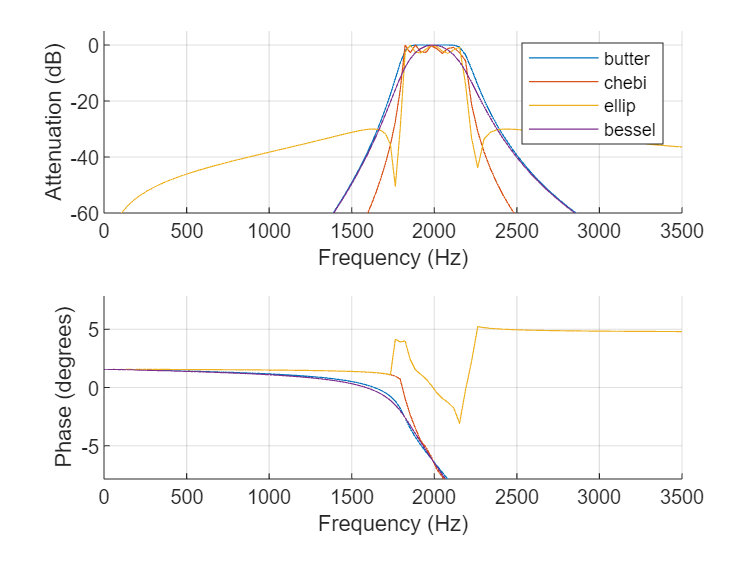  

#### Courbes de Bode:  
Filtre PB d'ordre 2, $f_c$ à 1kHz  

  

On voit que plus le facteur de qualité augmente, plus le pic est haut et étroit.  

Q=0.707, c'est un filtre de Butterworth.  
Q=0.57, c'est un filtre de Bessel.  

Un grand cateur d'amortissement en gros ça donne comme un Bessel.  

### Ex 2: Approx de Butterworth

Sys linéaire, permet jamais de réaliser la caractéristique idéale de filtrage (mur de brique), seulement de s'en approcher.  

exo: respecter le gabarit:  
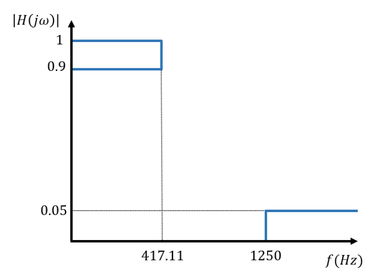  

1. déterminer l'ordre $n$ minimum du filtre  
2. déterminer la fréquence de coupure $f_c$ pour **réaliser la bande passante exactement**  
3. Déterminer les pôles de la fonction **normalisée** et en déduire son expression $H(p)$  

#### 1:

**! Voir annexe approx Butterworth, il y a LA formule à retenir, PEUT TOMBER À L'EXAM !!!**  

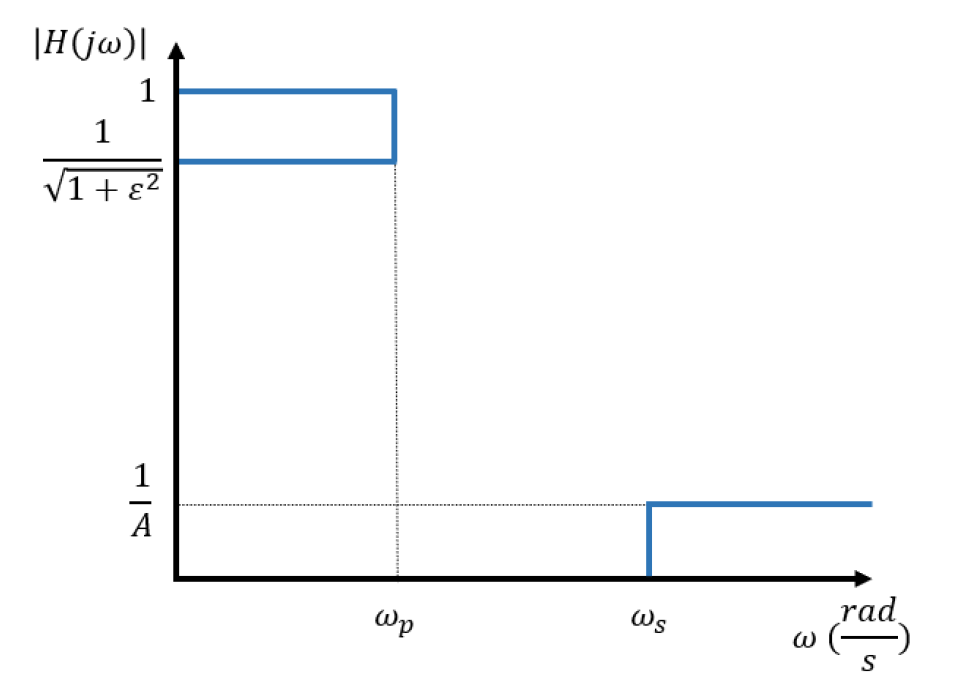

Les choix de l'ordre n minimum et de la fréquence de coupure dépendent des spécifications du gabarit ; en particulier de la tolérance ε en bande passante et de l'atténuation 1/A en bande d'arrêt :  
$\omega_s=1250$ Hz $=7853.98$ rad/s  
$\omega_p=417.11$ Hz $=2620.78$ rad/s  
$\frac{1}{A}=0.05$  
$\frac{1}{\sqrt{1+\varepsilon^2}}=0.9$  
$\Rightarrow$ $A=20$, $\varepsilon=0.4843221$  

On obtient alors les contraintes suivantes sous forme d’un système d’équations vous permettant d’obtenir n et $\Omega_c$ à partir du cahier des charges du filtre (A, $\varepsilon$ et $\Omega_p$):
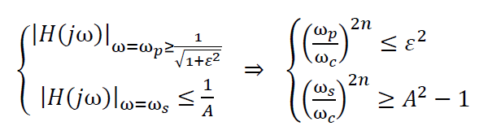  

$\Rightarrow$ ordre $n\ge3.39$ donc prenons 4.  

#### 2:
Doit passer au point:  
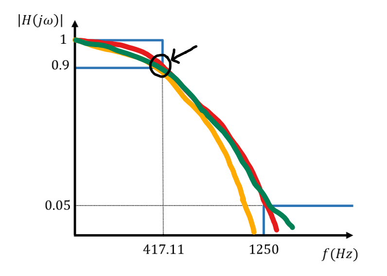  

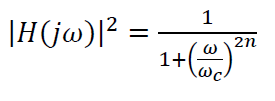  
(on peut changer les $\omega$ en $f$ hein ici)  

$\Rightarrow$ $f_c=499.99$ Hz  

#### 3:

poles de la fonction de transfert normalisée ($\omega_c=1$) sont les valeurs $p_k$:  
$\tilde p_k = je^{j\frac{\pi}{2n}(2k-1)}$ k=1,...2n  

On a 8 pôles mais on en garde que 4 dont on veut ceux dont la partie réelle est négative. (ils sont répartis sur un cercle trigonométrique dans le plan complexe, équidistants les uns des autres). La fonction de transfert normalisée peut s’exprimer de la manière suivante :  
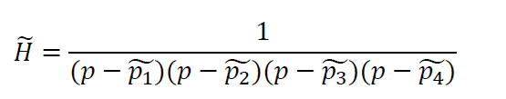  

Puis pour revenir à la focntion de transfert non-normalisée:  
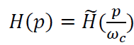  

ducoup vrais pôles: les pôles normalisés multipliés par $\omega_c$  

faut juste rentrer dans le code : `pNormalized(k) = 1j*exp(1j*(pi/numberofPoles)*(2k-1)) ;`  

### Ex 3: Transformation des prototypes passe-bas
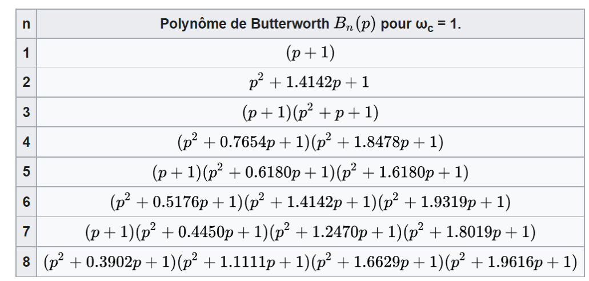  

on a bien -80dB / décade  

$3.1^{-4}$  

On voit bien que c'est un second ordre, ça se croise à -2dB, et on voit la différence -20dB/décade ou -40dB/décade.  

#### passage vers passe-haut non-normalisé
Même H(p) du tableau, juste changement de variable.  

d'ordre 4  

#### passage vers passe-bande non-normalisé
Même H(p) du tableau, juste changement de variable.  

d'ordre 4  

ordre 4 passe-bande: 8 pôles (16 pôles en tout, mais 8 à gauche) car c'est un enchainement de deux filtres en série (un PB et un PH)  

#### passage vers coupe-bande non-normalisé
Même H(p) du tableau, juste changement de variable.  

d'ordre 4  

### Ex 4:
Un beau RLC  
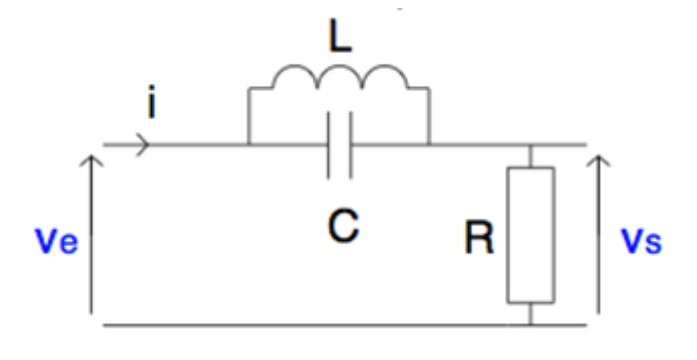  

1. démontrer sur papier encalculant la fonction de transfert que c'est bien un filtre coupe-bande.  

$V_s/V_e = \frac{R}{R+\frac{j\omega L}{1-\omega^2 LC}}$

2. Dimensionner les composants pour rejeter 50Hz  
faire tendre la norme pour 50Hz vers 0  

$\Rightarrow$ $\omega_c = \frac{1}{\sqrt{LC}}$  
$\Rightarrow$ $LC= \frac{1}{\omega_c^2}=3.18*10^{-3}$  

3. Exprimer la fct de transfert de ce filtre d'ordre 1 sous sa forme canonique et en déduire $omega_0$ et $q$ en fct de R, C et L.  
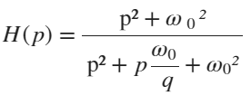  

> ici vaut mieux toujours travailler en $p$ plutot qu'en $j\omega$, c'est plus rapide/facile.  

$\Rightarrow$ $H(p)$ ...  

$\Rightarrow$ $\omega_0 = $

$\Rightarrow$ $q = \frac{\sqrt{...}}{...}$

4. Sur base de cette fct de trasnfert canonique, vérif dans Matlab l'allure du filtre réalisé et observer l'effet d'une variation du facteur de qualité Q.  

Plus le facteur de qualité est grande, plus la pente est raide (la sélectivité est meilleure).  

5. Vérifier quantitativement l'impact d'une tolérance de 10% sur la valeur de l'inductance sur la fréquence centrale de réjection du filtre vu au point précédent. Comparer ensuite les diagrammes de Bode ci-dessous.  

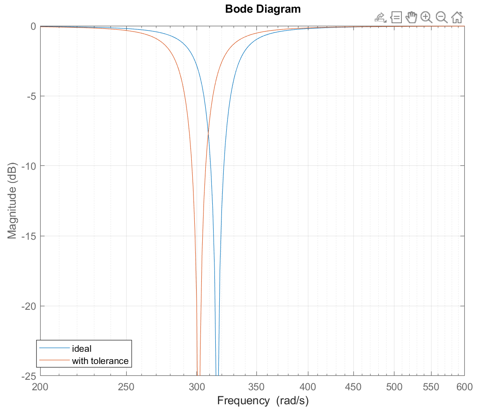  

6. Vérifier, qualitativement en analysant le circuit et quantitativement via la fct de transfert, l'impact d'une résistance parasite série sur la réjection du 50Hz.  

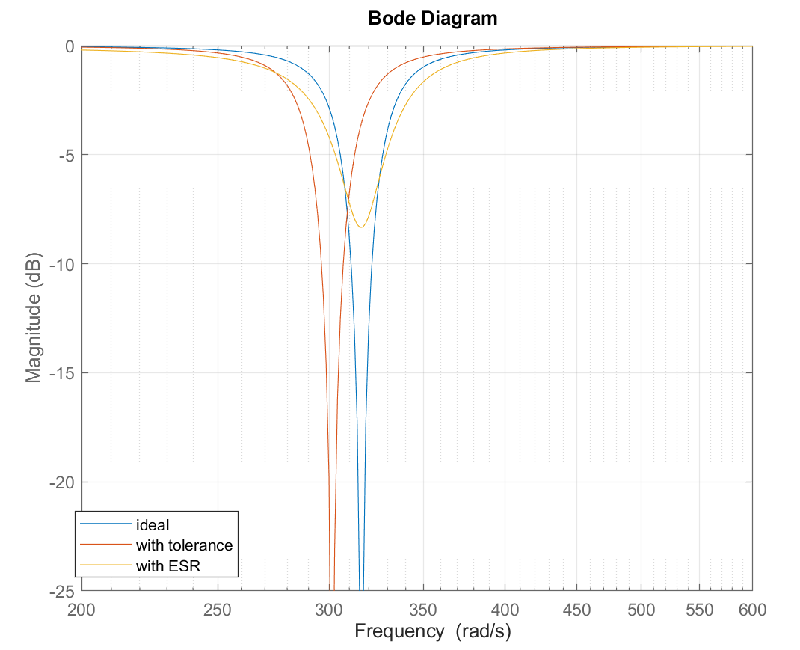  

> ESR: equivalent series resistance  

dû à la résistance intrinsèque du bobinage de l'inductance, permet à un peu du signal de passer. donc le puit n'est pas infini.  

## Partie 2

### Ex 1: Transformation bilinéaire
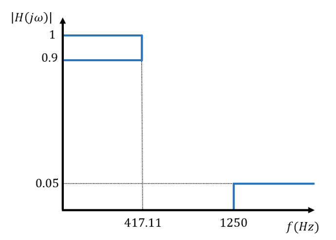  

1. Déterminer l'ordre et la pulsation du **filtre analogique** respectant le gabarit ainsi que sa fct de transfert.  

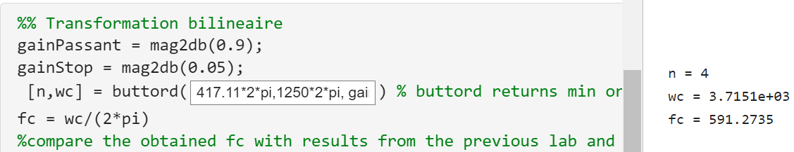  

On (ici matlab) coupe un peu plus tard pour couper nickel au point d'en bas:  
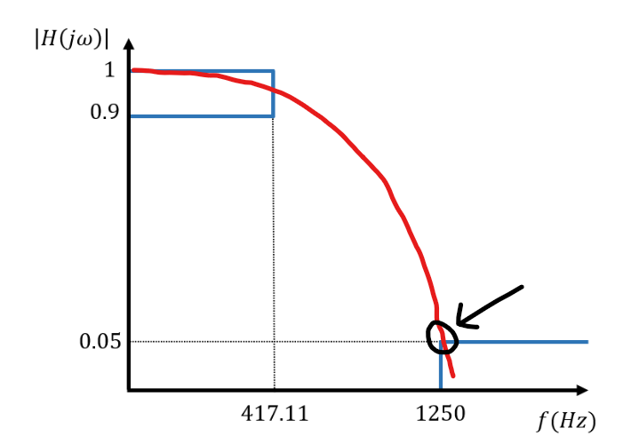  

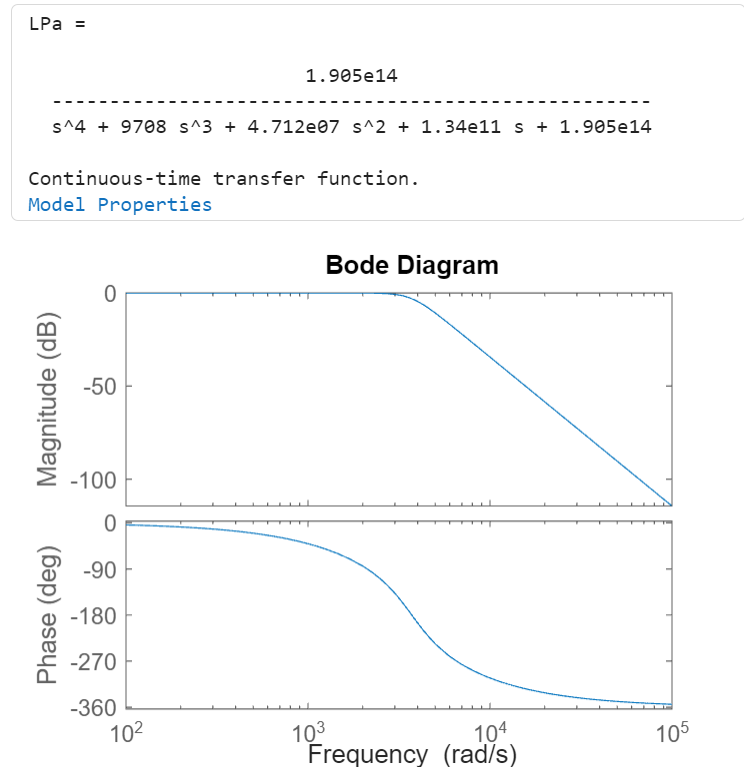  

2. sans résoudre ou simplifier, exprimer la fct de transfert du filtre **numérique** équivalent (sur papier).  
...  

3. A l'aide de l'approx bilinéaire (matlab), déterminer la fct ^$H(z)$ du filtre numérique équivalent, sachant que le système numérique possède une fréq d'échantillonage de 10kHz.  

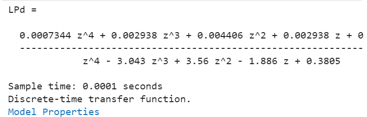  
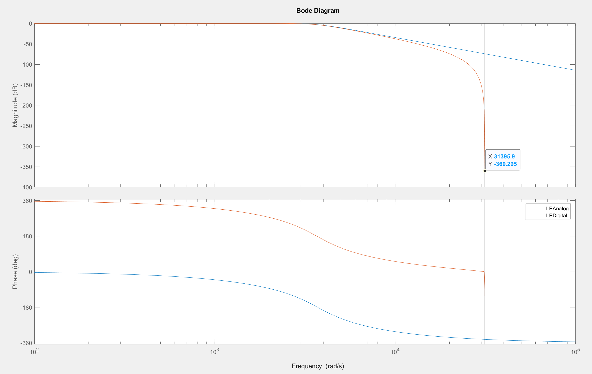  

...  
Phase: c'est du au délai  

4. Comparer les fcts de transfert et les courbes de Bode obtenues.  

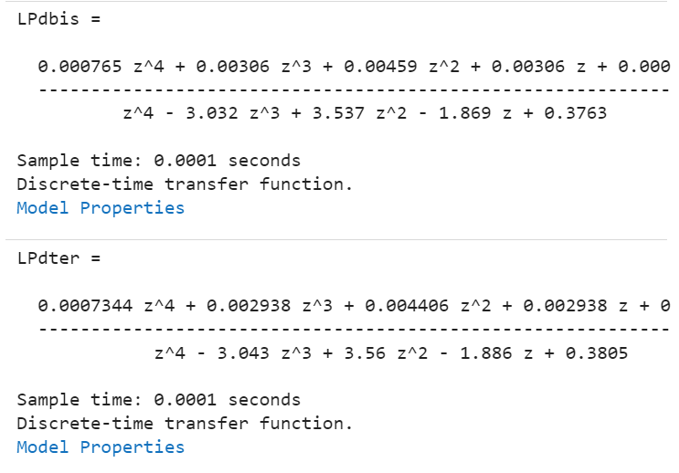  
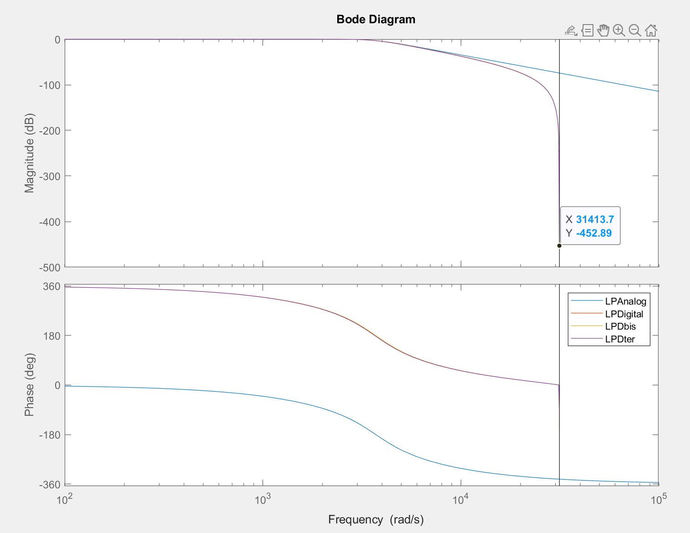  

5. Comparer les réponses en fréquence des filtres numériques et du filtre analogique et conclure sur la distortion due à l'approx bilinéaire.  

..?  

6. Proposer une solution pour que le filtre numérqiue ait la même atténuation que le filtre analogique pour $f=3.2$ KHz. Implémenter cette solution sur matlab...  

On va utiliser le "PrewarpFrequency", toujours avec 'tustin' (bilinéaire)  

Code: `options = c2dOptions('Method', 'tustin', 'PrewarpFrequency', 3200*2*pi);`  

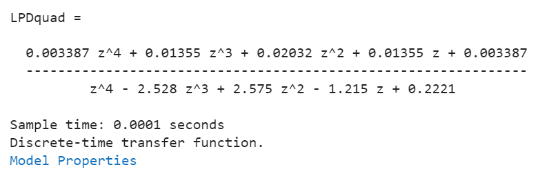  
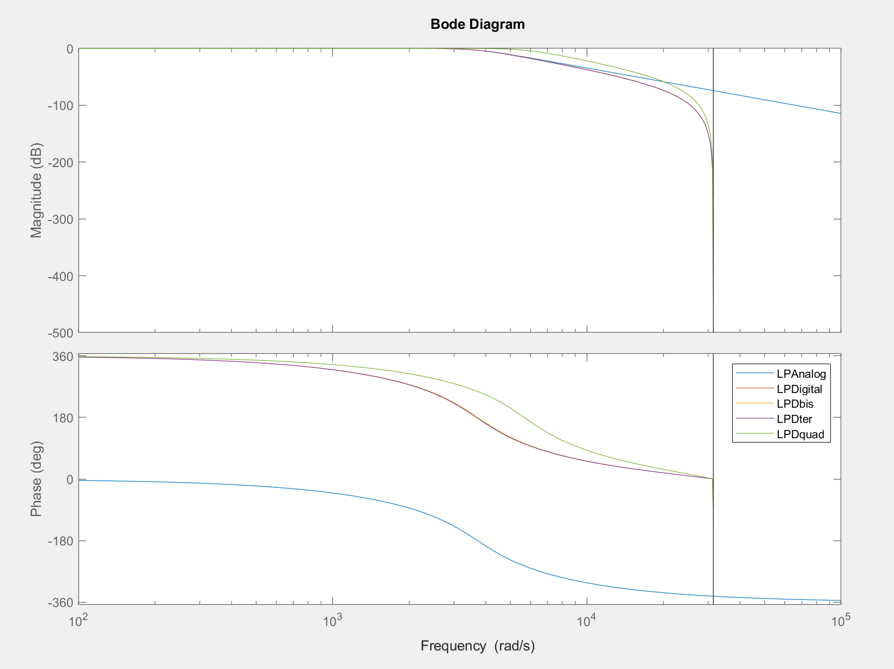  

