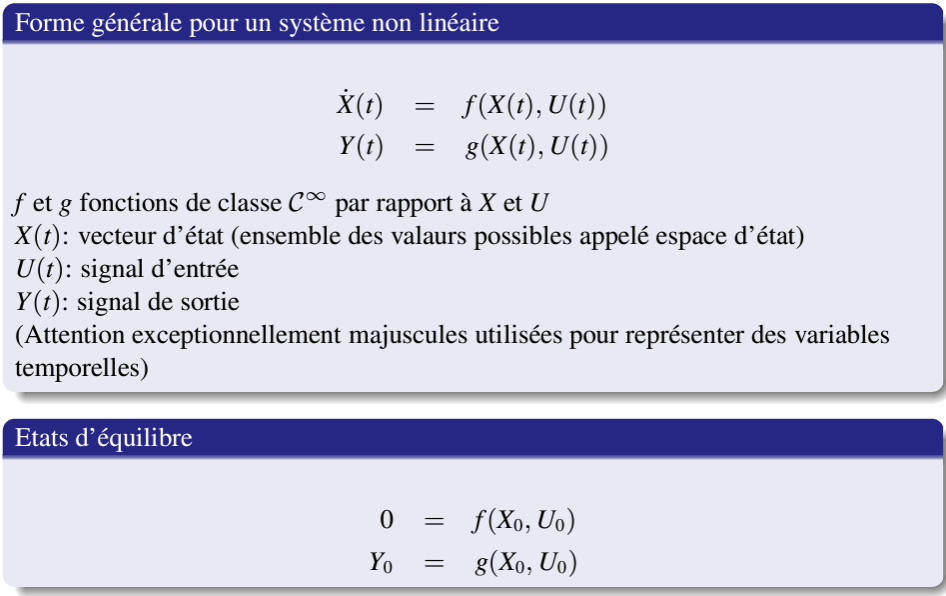
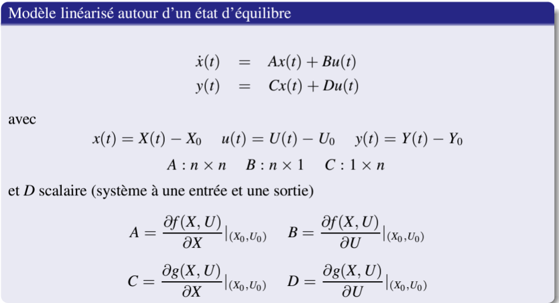
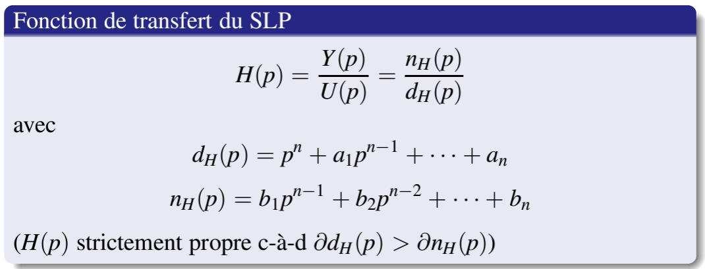
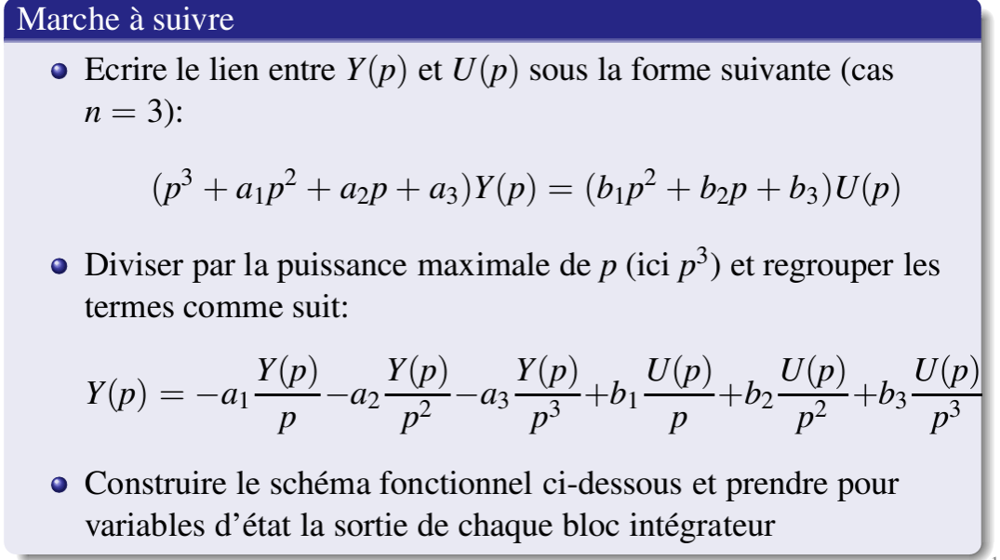
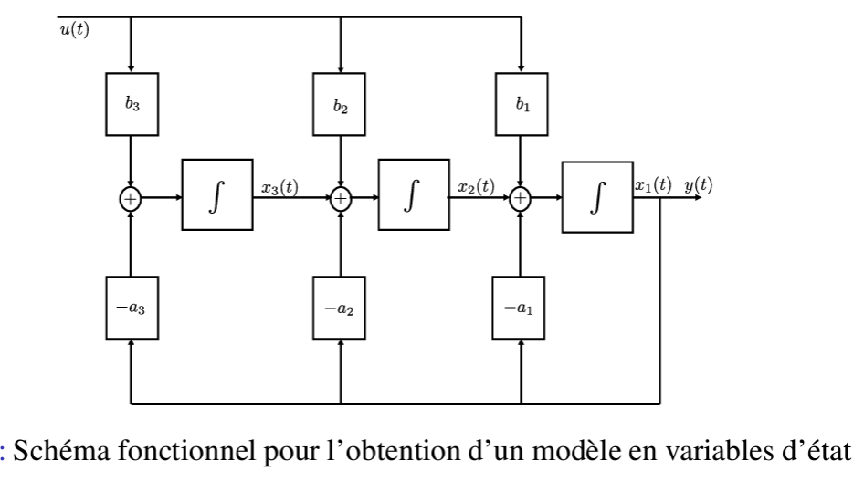
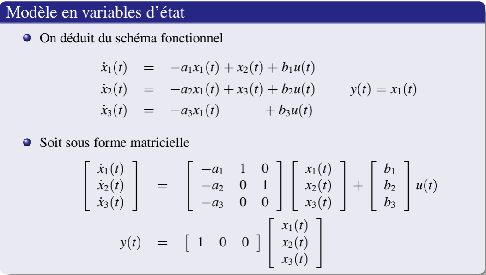
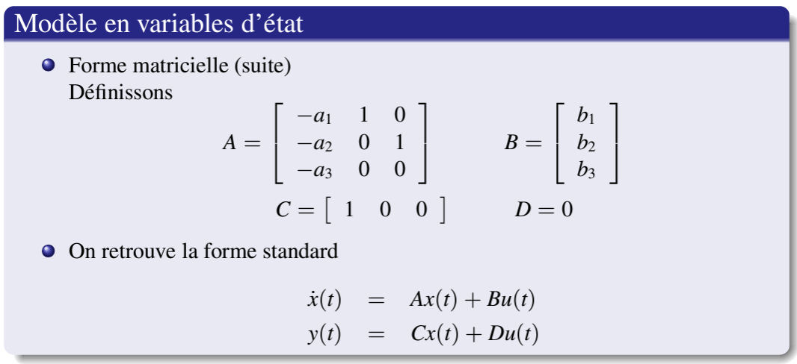
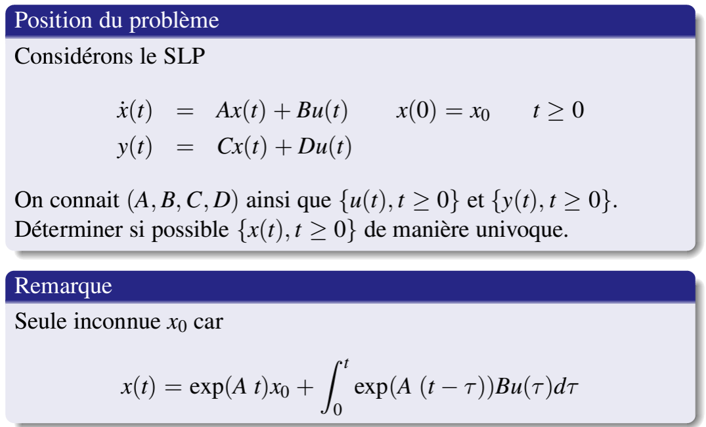

# Automatique - Cours 2 - 2024-02-12

## Chap 2

### Modélisation interne et externe

#### Modélisation par une équation différentielle ou un système d'équations différentielles

- Interne: systeme d'EDO du premier ordre faisant intervenir les variables physqiues internes au systeme (pas uniquement les grandeurs d'entree et de sortie) ou des grandeurs auxilières sans significations physique -> **desciprtion en varaibles d'état**  

- Externe: EDO faisant intervenir uniquement les grandeurs d'entrée (signal réglant et perturbations) et de sortie (signal réglé)  

exemples slides 31 -> 33 ?  

...  

#### Cas d'un système non-linéaire
> steady state ?  

...  

**Linéarisation** de l'éq autour d'un état d'équilibre $h=h_0$  
> slide 46  

=> on finit par obtenir une EDO linéaire  

...  

évolution du gain statique avec l'état d'équilibre  
voir slide annoté 50  

...  

##### Messages:
- Systeme non linéaire: gain statique et/ou temps de réponse varient selon le point de fonctionnement (ou l’état d’équilibre)  
- **Pente de la caractéristique statique ne un point $\equiv$ gain statique modèle linéarisé en ce point**  
- Rapidité de la répons einversément proportionnelle à position du pôle de la fonction de trasnfert du premier ordre  

### Récapitulation

slide 54 -> 58  
réponse impulsionnelle, réponse indicielle  

-----------

## Chap 3 - Étude des modèles en variables d'état

### Concepts de base

#### Description en variable d'état

#### Solution des équations d'état dans le cas linéaire
slide 8  
Exp d'un matrice...  

#### Passage d'une description en variables d'état à une fonction de transfert

transfo Laplace d'une exp de matrice...  

$H(p)=$ ...

Pôles de la fonction de transfert identiques aux valeurs propres de la matrice A si pas de simplification entre numérateur et dénorminateur  

### Passage d'une fonction de transfert à un modèle en variable d'état

#### Fonction de trasnfert du SLP

#### Marche à suivre

> équivalent (Laplace inverse) -> tous les $1/p$ sont devenus des intégrateurs  

#### Modèle en variables d'état

-------------------------------
# la suite sera en fait au prochain cours

#### Cas d'une fonction de transfert de même degré au numérateur et au dénominateur

> slide 16, 17 ...  

### Notions d'observabilité et de gouvernabilité

#### Détermination de l'état - Observabilité

