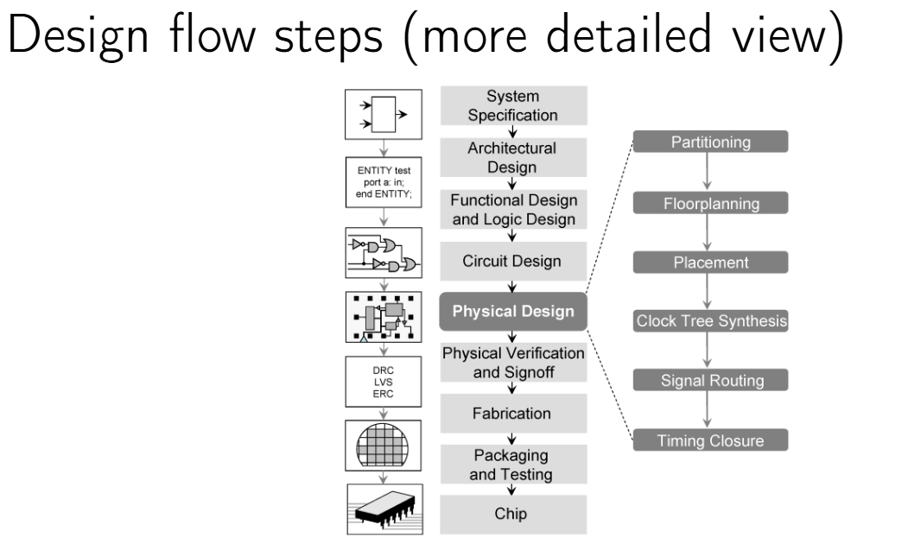
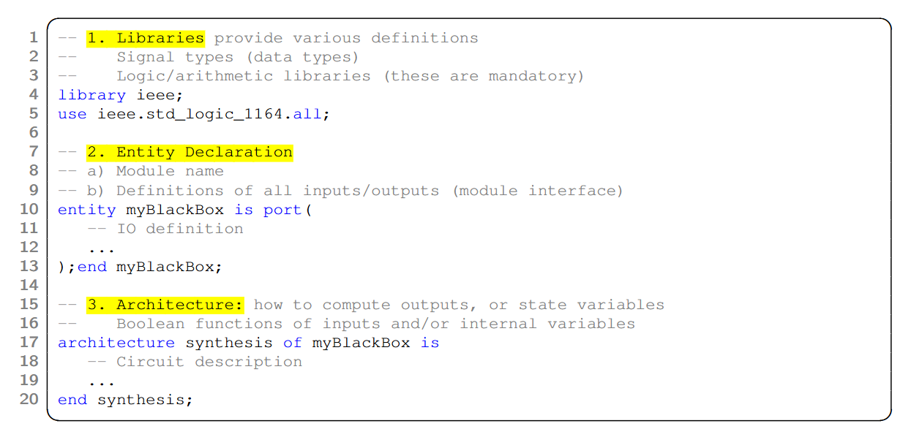
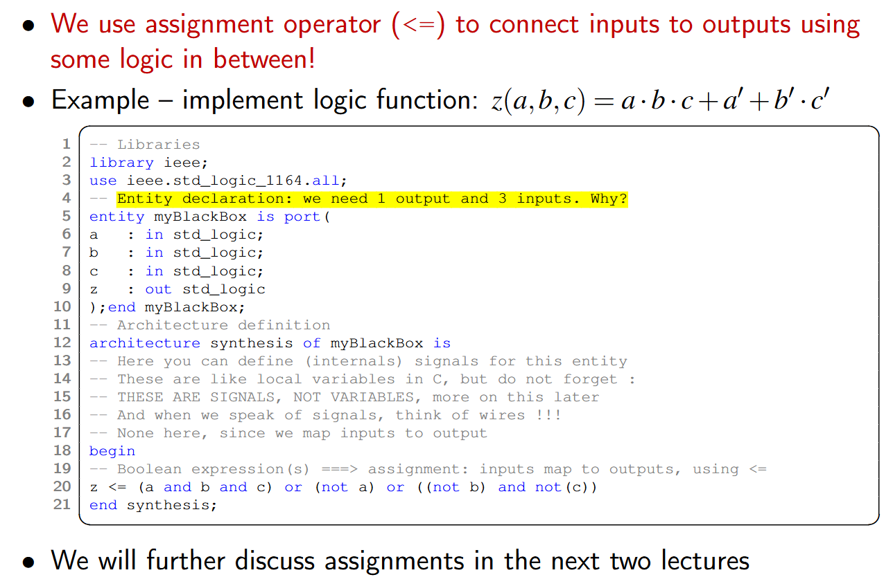
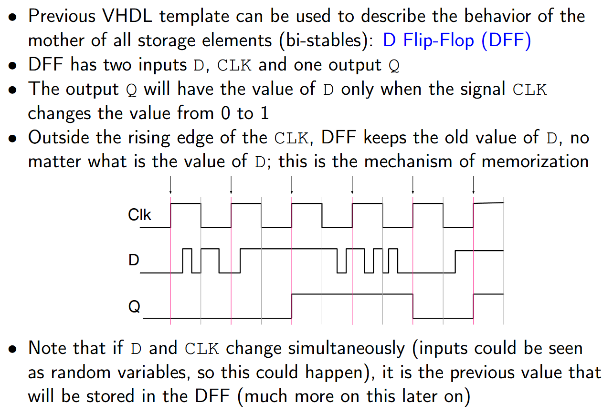
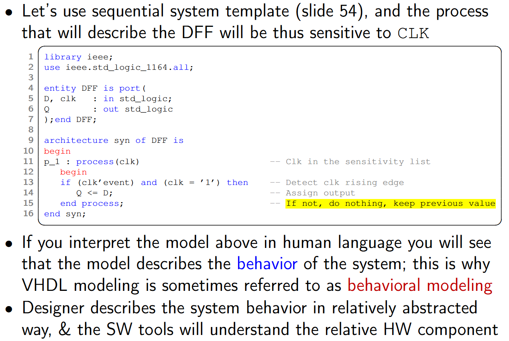
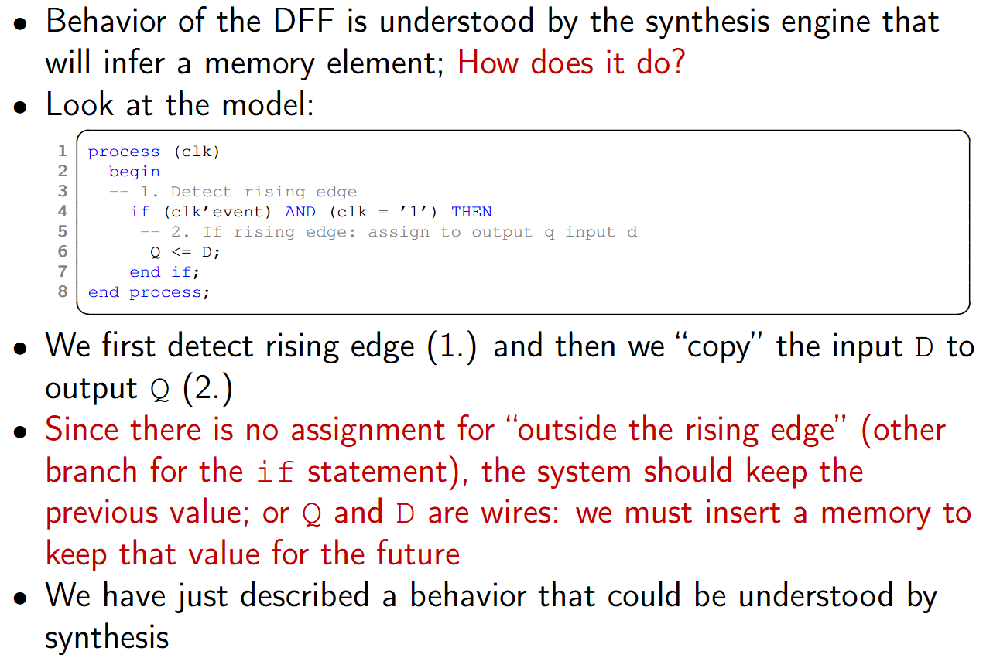
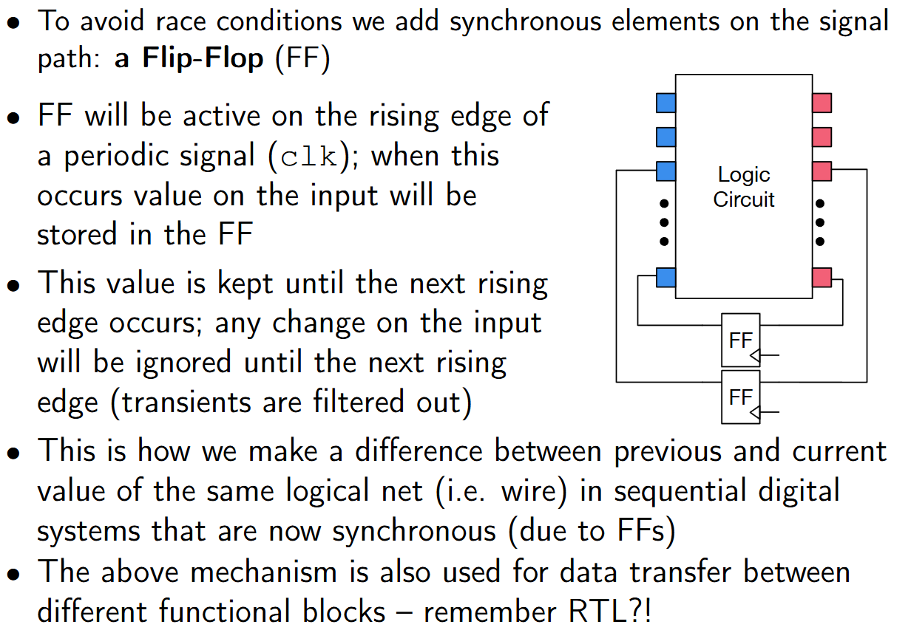

# Lecture 2 - Digital Arch & Design - 24/09/2025
> suite th1: Intro to VHDL

### Design flow

sequence of differernt implementation steps  

design flow is usually done by teams of people, so that's quite some work  

#### Steps - coarse view
(slide 39)  

- System specification: high-level description languages, decide on a global system micro-architecture  
- _RTL_ modeling & functional simulation: .................  
- Synthesis: transforms HDL desc into Gate-level netlist (logic representation of circuit). human-readable text file, a list of all the gates and their connections  
- Placement & Routing: decide on: where components (gates) are placed, and then routing on how they're interconnected  
- Sign-off: validation of properties of the circuit before manufacturing (timing, power, thermal, mechanical etc)  

placement: ASICs vs FPGAs: scale is very different (a LOT more gates in ASICs)  

Design flow steps are done using EDA tools (note: plural!)  
High complexity so we often don't have the optimal solution, we try to get the best one we can.  
  

illustration from RTL (this is verilog) to netlist: slide 41  
illustration placed & routed design (asic): slide 42, gates/standard cells are abstracted to black boxes on the left. on the right wires layers for interconnections.  

#### Design flow differences: ASIC vs FPGA

- in ASICs, we place standard cells (predefined logic gates, assembled from basic transistors & electrical requirements)  
- in FPGAs, we place (& route) logic cells (LC), memory blocks, or pre-existing DSPs  
    (LC placement is LUT/SRAM allocation because fpgas are already placed).  

Final output for FPGAs, we have **bitstreams** (config files) and for ASICs we have databases of drawings.  

### VHDL primer
> slide 45 to..  

#### Basic elements
Comments, Identifiers, Numbers  

#### Data types
**Data types**: extremely important (type conversions are possible but need extra care), predefined types (`bit`, or `std_logic` that also has "don't care"s etc), user-defined types, arrays and matrices  
VHDL is strongly-typed (even more than C)  

#### Assignments, operators & expressions
logic or arithmetic operators, and relations  

assignments (`<=`) should be understood as the right part is output, and left part is input (data flows from right to left)  

#### Basic building block
In VHDL it's called an **entity** (like a module in verilog)  
An entity will define a HW module in our design  
(good practice: one HW entity per VHDL file)  

template for a HW entity
  

- libraries (we'll be using `ieee` the most): for data types or logic/arithmetic operations  
- entity declaration: module/entity name, definition of all I/Os  
- architectures: useful to have multiple architectures for the same entity (e.g for simulation vs physical implementation)  

#### Entity & circuit view basic building block
**Ports**, to establish I/O with external world  
will become pins/pads in physical circuit  

> example of simple combinatorial circuit: slide 50  
>   

#### Port assignment: fundamental rule!
we talk about wires!  
**No output on the right hand side of the assignment!**  

This is because it would mean feedback on signals!  
Circuits with feedback are sequential but are **asynchronous**, so are subject to **race conditions** due to being asynchronous! And if race conditions are not handled properly, circuit won't work as it should.  
Race conditions are solved using synchronization, resulting in synchronous sequential logic circuits.  

> we can't do it like software where we can do `a = a+b` because in SW everything is memory locations, but in HDL everything is wires!  

_**!!! VHDL is NOT a programming language !!!**_  
We do not program FPGAs, we **configure** them with some logic.  

#### Sequential circuits - overview
**`process`** statement describes sequential logic (async & sync)  
Here we assume sync circuits only  

**Activation** of a process if done through a **sensitivity list**  
If one of the signals in this list changes value, it triggers function description evaluation (statements within the process, that will be executed sequentially)  
Attention! process "activation" refers to simulation only  

#### VHDL `process` and clocks
if a CLK is in the sensitivity list, then if the "branch" (not really a branch?) is taken, whatever occurs after will occur only during the **rising edge** transition of the CLK.  
(See slide 54)  

Flip-flop memories are typical examples of such circuits.  

This is a **behavioral** description.  

#### Sequential circuits – D Flip-Flop
  
anything that's outside of the rising edge of CLK is ignored.  

#### model DFF in VHDL
  

We describe the behavior of the flip-flop through VHDL code  
Think of VHDL as behavioral modeling.  

Where does the momerization comes from ?  

#### Insisting on memorization mechanism
  

We didn't mention what happens "outside the rising edge", the system should keep the previous value. We must insert a memory to keep that value for the future  

#### Synchronous sequential logic circuits
flip-flops are essential  

  

#### Multiple processes
Logic circuits are **concurrent** by nature, more than one process can be defined inside a single VHDL module/entity.  
Processes are independent one from another  

> example: slide 59  

### Practical example

#### Example 1
slide 61  

fully combinatorial circuit with registered output  

#### Example 2
slide 62  

two concurrent circuits  

#### Example 3
slide 63

these two do exactly the same thing  
The only time the order matters is only for simulation within the process (it's executed sequentially)  

